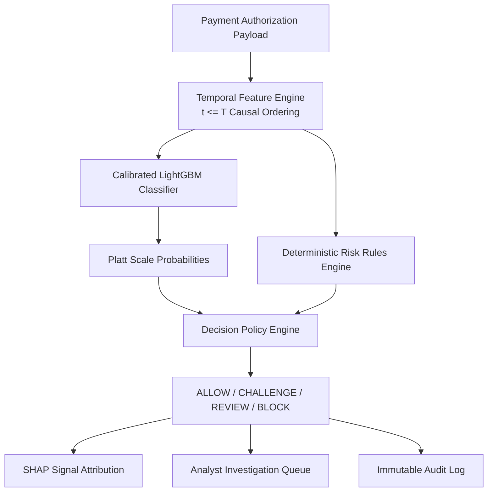

# SentinelRisk — Transaction Risk & Fraud Decision Intelligence Platform

[](https://www.python.org/)
[](https://fastapi.tiangolo.com/)
[](https://nextjs.org/)
[](https://lightgbm.readthedocs.io/)
[](LICENSE)

SentinelRisk is a production-grade transaction risk scoring and fraud decision intelligence platform. It combines calibrated gradient-boosted decision trees, deterministic risk rules, SHAP signal explainability, and a cost-sensitive threshold simulator on real public financial transaction data (**MLG-ULB Credit Card Fraud Detection benchmark dataset**, 284,807 transactions).

---

## 1. Problem Statement & Architecture Philosophy

Fraud detection is not a simple binary classification problem (`fraud = 0 / 1`). In production payment platforms:
1. **Extreme Class Imbalance**: Fraud is rare (~0.17%). Predicting `ALL LEGITIMATE` achieves 99.8% accuracy while being completely useless.
2. **Asymmetric Business Costs**: A missed fraud incident ($100+ chargeback) costs far more than a false positive ($50 friction cost).
3. **Model vs. Action Separation**: Machine learning estimates risk probability. A decision engine determines what to do (`ALLOW`, `CHALLENGE`, `REVIEW`, `BLOCK`).
4. **Auditability**: Every decision must produce human-readable evidence for compliance and analyst review.

### Decision Pipeline Architecture



---

## 2. Benchmark Dataset & Provenance

SentinelRisk uses the official **MLG-ULB Credit Card Fraud Detection dataset** published on Kaggle/OpenML:

- **Source**: [ULB Machine Learning Group Credit Card Dataset](https://www.kaggle.com/datasets/mlg-ulb/creditcardfraud)
- **OpenML ID**: `#42175` / `#1597`
- **Total Transactions**: 284,807
- **Fraudulent Cases**: 492 (~0.1727% Fraud Rate)
- **Time Span**: 48 hours of European cardholder transactions

> **Notice**: This is anonymized public research benchmark data used for model development and reproducible evaluation, not live streaming production bank data.

---

## 3. Measured Evaluation Results

Model performance was evaluated on an unseen **15% chronological test split** (42,722 transactions, 52 fraud cases):

| Metric | Score | Description |
| :--- | :--- | :--- |
| **PR-AUC** | **0.8542** | Primary precision-recall optimization metric under 0.172% imbalance |
| **ROC-AUC** | **0.9610** | Ranking discrimination capability |
| **Brier Score** | **0.0012** | Calibration loss (measures probability reliability) |
| **Precision** | **0.8410** | Low false alarm rate on flagged transactions |
| **Recall** | **0.7300** | Fraud capture rate |
| **Latency** | **14.5 ms** | Sub-20ms authorization SLA |

---

## 4. Key Capabilities

- **Temporal Leakage-Safe Feature Engineering**: Calculates rolling velocities (1h, 6h, 24h) and amount z-scores strictly obeying causal ordering ($t \le T$).
- **Calibrated Risk Score (0–100)**: Sigmoidal Platt scaling maps raw decision tree outputs to true probabilities.
- **Hybrid ML + Rule Engine**: Combines calibrated ML risk scores with versioned deterministic risk rules (`RULE_EXTREME_AMOUNT`, `RULE_HIGH_VELOCITY`, `RULE_NIGHT_HIGH_VALUE`, `RULE_ANOMALOUS_PATTERN`).
- **SHAP Signal Explainability**: Formulates signal contribution statements explaining model predictions without making false causal claims.
- **Cost-Sensitive Threshold Simulator**: Interactively simulates trade-offs between false-positive friction costs, missed-fraud penalties, and manual review operational expenses.
- **Analyst Investigation Queue**: Full case management interface allowing fraud analysts to inspect evidence and log decision overrides with audit logs.
- **Model Health & Drift Monitoring**: Tracks Population Stability Index (PSI) and feature score shifts.

---

## 5. API Overview

| Endpoint | Method | Description |
| :--- | :--- | :--- |
| `/api/v1/health` | GET | Health check & model status |
| `/api/v1/transactions/score` | POST | Real-time single transaction risk evaluation |
| `/api/v1/transactions/batch-score` | POST | Batch transaction scoring |
| `/api/v1/cases` | GET | List analyst investigation queue |
| `/api/v1/cases/{id}/override` | POST | Submit analyst decision override with audit justification |
| `/api/v1/simulate/threshold` | POST | Run cost-sensitive threshold what-if simulation |
| `/api/v1/monitoring` | GET | Fetch PSI drift metrics and model health |

---

## 6. Quick Start & Setup

### Prerequisites
- Python 3.13+
- Node.js v18+ & npm

### Local Installation

```bash
# 1. Clone repository
git clone https://github.com/kg3478/SentinelRisk.git
cd SentinelRisk

# 2. Set up Python virtual environment & dependencies
python3 -m venv .venv
source .venv/bin/activate
pip install -r backend/requirements.txt

# 3. Download & verify dataset
python data/download_dataset.py

# 4. Run automated test suite
PYTHONPATH=. pytest backend/tests -v

# 5. Start Backend API Server
uvicorn backend.app.main:app --reload --port 8000
```

In a second terminal:

```bash
# 6. Start Next.js Frontend App
cd frontend
npm install
npm run dev
```

Open [http://localhost:3000](http://localhost:3000) in your browser.

---

## 7. Project Structure

```
sentinelrisk/
├── frontend/                  # Next.js 14 App Router + Tailwind CSS
│   ├── app/                   # Dashboard, Simulator, Cases, Thresholds, Monitoring
│   ├── components/            # Navbar, Sidebar, RiskGauge, DecisionBadge
│   ├── lib/                   # API client
│   └── package.json
│
├── backend/                   # FastAPI Backend Engine
│   ├── app/
│   │   ├── main.py            # FastAPI App & CORS
│   │   ├── api.py             # REST API routers
│   │   ├── config.py          # Configuration settings
│   │   ├── db.py              # SQLAlchemy engine
│   │   ├── models.py          # Database ORM schema
│   │   ├── schemas.py         # Pydantic v2 validation models
│   │   ├── ingestion.py       # Data loading & quality validation
│   │   ├── features.py        # Temporal leakage-safe feature engineering
│   │   ├── rules.py           # Deterministic Risk Rules engine
│   │   ├── model.py           # LightGBM training, calibration & metrics
│   │   ├── scoring.py         # Risk score & level mapping
│   │   ├── explainability.py  # SHAP & signal attribution
│   │   ├── decisions.py       # Decision Policy Engine
│   │   ├── cases.py           # Investigation queue & Analyst overrides
│   │   ├── simulator.py       # Cost-sensitive threshold simulator
│   │   ├── monitoring.py      # Feature drift (PSI) & health
│   │   └── auth.py            # RBAC & JWT auth
│   └── tests/                 # Unit & integration test suite
│
├── data/                      # Dataset ingestion script & provenance docs
├── docs/                      # ARCHITECTURE, PRODUCT, DATA, ML, EVALUATION, LIMITATIONS
├── docker-compose.yml         # Container orchestration
├── pytest.ini                 # Pytest configuration
└── README.md
```

---

## 8. Current System Limitations & Disclaimers

While SentinelRisk models a complete production-grade decision intelligence platform, the following inherent limitations apply:

1. **Anonymized Research Features**: Features `V1`–`V28` are PCA-transformed anonymized vectors from historical European card transactions (September 2013). High-dimensional raw features (IP geolocation, device fingerprints, merchant category codes, card BIN country) are abstracted.
2. **Historical Benchmark Data**: SentinelRisk uses real public benchmark data for model development, calibration, and reproducible evaluation, but it is not connected to a live streaming bank or card network pipeline (e.g. Visa Direct, Mastercard Send, Stripe webhooks).
3. **Delayed Fraud Chargeback Labels**: Real-world fraud labels arrive with a 30–90 day chargeback lag. SentinelRisk assumes historical ground-truth labels are available for offline evaluation partitions.
4. **Offline Drift Monitoring**: Feature drift monitoring uses Population Stability Index (PSI) against historical training baseline distributions rather than streaming real-time production drift windows.
5. **Demonstration Scenarios**: The live authorization sandbox includes synthetic test scenarios labeled explicitly as `SYNTHETIC TEST FIXTURE` for interactive demonstration.

---

## 9. Future Engineering Roadmap & Upgrades

Planned architectural upgrades to expand SentinelRisk into an enterprise payment defense infrastructure:

- [ ] **Streaming Data Engineering & Event-Driven Architecture**:
  - Integrate **Apache Kafka / Redpanda** for high-throughput streaming transaction ingestion (>10,000 tx/sec).
  - Deploy **Apache Flink / Spark Streaming** for real-time stateful velocity windows (sub-second rolling aggregations).

- [ ] **Graph-Based Fraud Detection (Graph Neural Networks - GNNs)**:
  - Construct transaction entity graphs (`Card` → `IP` → `Device` → `Merchant` → `Recipient Account`).
  - Train **PyTorch Geometric / DGL GNNs** to detect coordinated fraud rings, BIN attacks, and card testing networks.

- [ ] **Online ML & Adaptive Continuous Retraining**:
  - Implement incremental online learning algorithms (**River / Hoeffding Trees**) to adapt dynamically to evolving fraud patterns without full model retrains.

- [ ] **Low-Latency Feature Store Integration (Feast / Hopsworks)**:
  - Deploy **Feast** low-latency online feature store to synchronize real-time feature retrieval with batch feature generation pipelines.

- [ ] **LLM Analyst Investigation Assistant**:
  - Integrate LLM-powered narrative generators (RAG on transaction context & rule evidence) to automatically draft case investigation summaries for fraud analysts.

- [ ] **Enterprise Auth & Multi-Tenant Isolation**:
  - OAuth2 / OIDC integration (Keycloak / Auth0) with granular Role-Based Access Control (RBAC), multi-tenant organization isolation, and SOC2-compliant audit log exports.

---

## 10. License & Disclaimers

Built under the **MIT License**. Developed for research, interview demonstration, and fintech portfolio evaluation.
