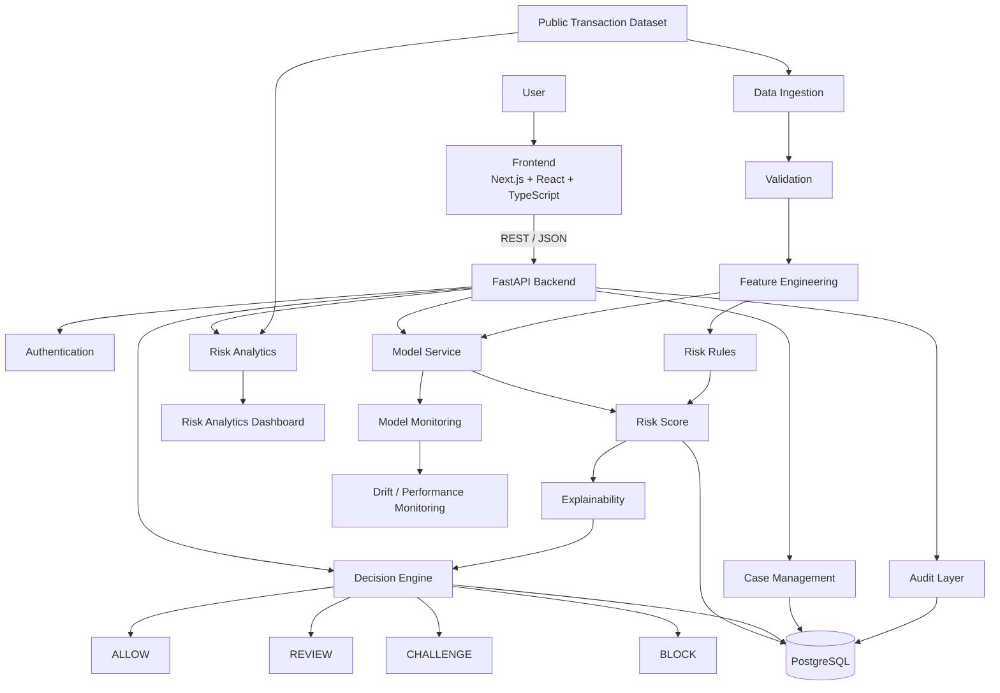
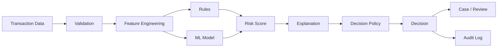
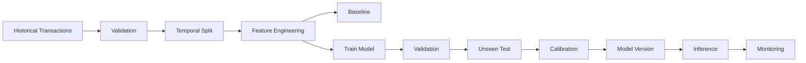
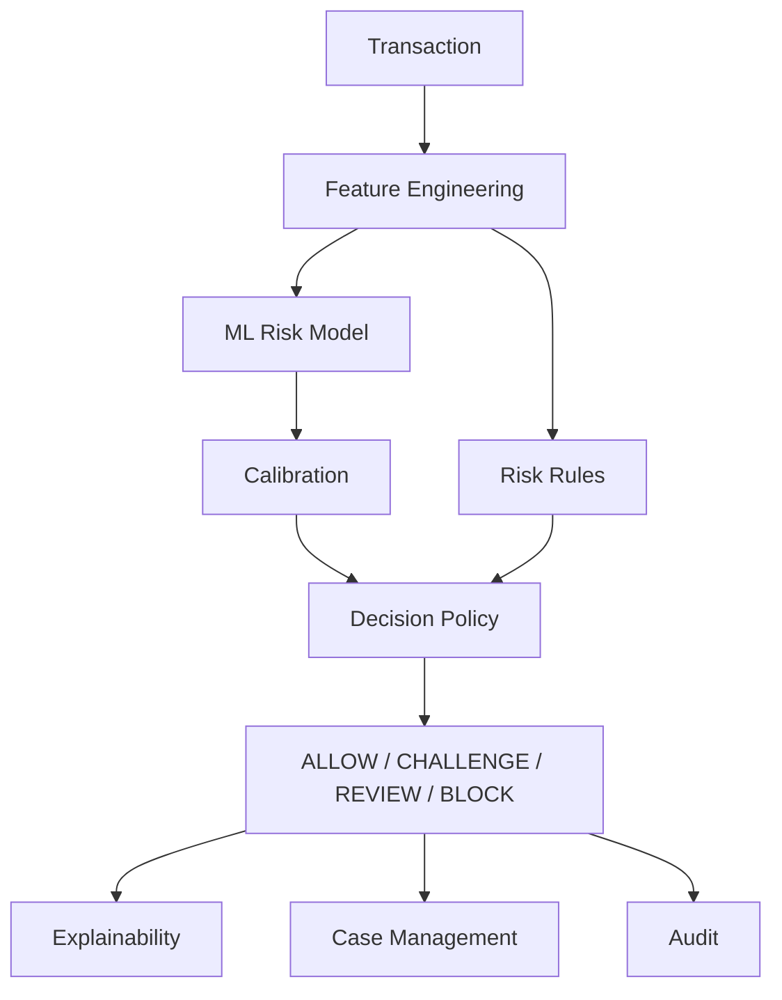

# SentinelRisk — Antigravity Master Build Prompt

## Purpose

Build **SentinelRisk**, a production-quality transaction risk and fraud decision-intelligence platform.

The product must use **real publicly available transaction/fraud data for development and evaluation**, while making no false claims about production banking data, customers, fraud savings, or live financial-institution deployment.

This is not a generic fraud-classification notebook.

It must be an end-to-end system:

**DATA → VALIDATION → FEATURE ENGINEERING → RISK MODEL → ANOMALY SIGNALS → EXPLANATION → DECISION → SIMULATION → AUDIT**

The final product should demonstrate:

- machine learning
- data engineering
- real-time decisioning
- risk scoring
- explainability
- rule + model combination
- human-in-the-loop decisions
- API/backend engineering
- product thinking
- measurable evaluation

---

# 1. Product Vision

SentinelRisk helps a fintech/payment platform evaluate transactions and determine:

1. Is this transaction likely to be fraudulent?
2. How risky is it?
3. Why is it risky?
4. Which signals contributed?
5. Should it be allowed, challenged, reviewed, or blocked?
6. How confident is the system?
7. What would happen if the decision threshold changed?
8. How does the model perform at different false-positive costs?
9. Can an analyst inspect and override a decision?
10. Can every decision be audited afterward?

Core decision loop:

**OBSERVE → SCORE → EXPLAIN → DECIDE → REVIEW → LEARN**

Do not build an application that only outputs:

```text
fraud = 0 / 1
```

The product must produce a **risk decision**.

---

# 2. Target Users

Design for:

### Fraud Analyst

Needs:

- suspicious transaction queue
- reasons for risk
- investigation workflow
- case status
- transaction history
- model/rule evidence

### Risk Manager

Needs:

- fraud rate
- approval rate
- false-positive rate
- blocked value
- reviewed value
- model performance
- threshold analysis

### Payments / Product Manager

Needs:

- authorization impact
- customer friction
- fraud-risk tradeoff
- decision policy
- business impact

### Engineering / ML Team

Needs:

- model metrics
- feature health
- drift
- latency
- decision logs
- model versions

---

# 3. Absolute Engineering Principles

## Simplicity over ceremony

Use the simplest architecture that solves the problem.

Do not create artificial abstractions.

Avoid unnecessary:

- BaseService
- BaseRepository
- GenericRiskEngine
- AbstractModel
- GenericAgent
- Manager classes
- utility files with one function

unless there is a genuine reason.

## Minimum file count

Every file must have a clear purpose.

Do not create:

```text
fraud_model_v2.py
fraud_model_final.py
fraud_model_final_new.py
risk_utils.py
risk_utils_new.py
temp.py
debug.py
old/
backup/
```

Remove unused files and dependencies before completion.

## Clean repository

The repository should look deliberately engineered by a strong human engineer.

## Frontend/backend separation

Use a clean monorepo.

## No fake enterprise complexity

Do not use microservices, Kubernetes, Kafka clusters, feature stores, or distributed infrastructure unless the actual implementation needs them.

The MVP should run locally using:

```bash
docker compose up
```

---

# 4. System Architecture

Use a **modular monolith** for the MVP.



## Core data flow



---

# 5. Repository Structure

Use:

```text
sentinelrisk/
├── frontend/
│   ├── app/
│   ├── components/
│   ├── lib/
│   ├── public/
│   ├── package.json
│   ├── tsconfig.json
│   └── next.config.ts
│
├── backend/
│   ├── app/
│   │   ├── main.py
│   │   ├── config.py
│   │   ├── db.py
│   │   ├── models.py
│   │   ├── schemas.py
│   │   ├── api.py
│   │   ├── ingestion.py
│   │   ├── features.py
│   │   ├── rules.py
│   │   ├── model.py
│   │   ├── scoring.py
│   │   ├── explainability.py
│   │   ├── decisions.py
│   │   ├── cases.py
│   │   ├── monitoring.py
│   │   └── auth.py
│   ├── tests/
│   ├── requirements.txt
│   └── Dockerfile
│
├── data/
│   ├── demo/
│   └── README.md
│
├── docs/
│   ├── ARCHITECTURE.md
│   ├── PRODUCT.md
│   ├── DATA.md
│   ├── ML.md
│   ├── EVALUATION.md
│   └── LIMITATIONS.md
│
├── tests/
│   └── e2e/
│
├── docker-compose.yml
├── .env.example
├── .gitignore
└── README.md
```

This is a starting point.

Do not create additional files unless they solve a real problem.

---

# 6. Technology Stack

Preferred:

### Frontend

- Next.js
- React
- TypeScript
- Tailwind CSS
- Recharts

### Backend

- Python
- FastAPI
- Pydantic
- SQLAlchemy

### Data

- PostgreSQL
- Parquet
- DuckDB where useful

### ML

- pandas/polars
- scikit-learn
- XGBoost or LightGBM if justified
- SHAP where useful

### Infrastructure

- Docker
- Docker Compose

### Testing

- pytest
- Playwright
- frontend testing framework

Do not add technologies without a concrete reason.

---

# 7. Real Data Requirement

Use real public transaction/fraud data for the core model-development and evaluation workflow.

A suitable primary dataset may be the widely used **Credit Card Fraud Detection** dataset containing anonymized European card transactions and fraud labels.

Document the exact dataset source, license/usage terms, schema, class imbalance, and limitations.

Do not claim:

> "This model was trained on live bank transactions."

Unless real production data is actually available.

The product must clearly distinguish:

- PUBLIC REAL-WORLD DATA
- SYNTHETIC DEMO DATA
- SIMULATED SCENARIOS

---

# 8. Data Ingestion

Support:

- CSV
- Parquet

Pipeline:

```text
RAW DATA
↓
Schema Detection
↓
Validation
↓
Normalization
↓
Feature Engineering
↓
Training / Inference Tables
```

Store ingestion metadata:

- source
- dataset version
- row count
- fraud count
- date range if available
- ingestion timestamp
- validation status
- hash

Never silently modify source data.

---

# 9. Data Quality

Validate:

- required columns
- data types
- missing values
- duplicates
- invalid transaction amounts
- label validity
- class distribution
- feature ranges
- malformed records

Generate a structured data-quality report.

Example:

```text
Rows: 284,807
Fraud: 492
Fraud rate: 0.1727%
Duplicates: PASS
Missing values: PASS
Label validation: PASS
```

Use actual dataset values when the dataset is loaded.

Never hardcode these metrics into the application.

---

# 10. Feature Engineering

Create meaningful transaction-risk features.

Potential categories:

## Transaction features

- amount
- amount percentile
- transaction frequency
- transaction velocity
- transaction time
- amount deviation

## Behavioral features

Where data supports them:

- recent transaction count
- recent spending amount
- frequency change
- unusual transaction amount
- repeated transaction pattern

## Temporal features

- hour
- day
- time since previous transaction

## Aggregated features

Where identifiers and historical ordering permit:

- rolling transaction count
- rolling amount
- rolling average
- amount-to-history ratio

Do not create features that require unavailable information.

---

# 11. Critical Leakage Rule

Fraud detection is extremely sensitive to leakage.

For a transaction at time `T`:

Only use information that would have been available at or before `T`.

Do not calculate a customer's historical feature using future transactions.

Do not randomly split temporally ordered transaction data if doing so causes future information to influence training.

Document all leakage prevention decisions.

---

# 12. Class Imbalance

Fraud is rare.

Do not optimize for raw accuracy.

A model predicting:

```text
ALL TRANSACTIONS = LEGITIMATE
```

may achieve very high accuracy while being useless.

Evaluate:

- precision
- recall
- F1
- PR-AUC
- ROC-AUC
- false-positive rate
- fraud capture rate
- fraud value captured

Prefer PR-AUC and business-relevant metrics for the highly imbalanced setting.

---

# 13. Model Development

Build progressively.

### Baseline 1

Rule-based baseline.

### Baseline 2

Logistic Regression.

### Candidate model

Gradient-boosted tree model such as:

- XGBoost
- LightGBM

Use only if it improves meaningful evaluation metrics.

Optional:

- Random Forest
- calibrated classifier

Do not start with deep learning.

Do not use an LLM for fraud classification.

---

# 14. Model Training Pipeline



Store for each model:

- dataset version
- feature version
- training period
- validation period
- test period
- model type
- hyperparameters
- random seed
- metrics
- model version
- code version

---

# 15. Risk Score

Produce a calibrated risk score:

```text
0.00 → 1.00
```

or:

```text
0 → 100
```

Document the mapping.

Example:

```text
0–20    LOW
21–50   MEDIUM
51–75   HIGH
76–100  CRITICAL
```

Do not arbitrarily choose thresholds.

Thresholds must be configurable and evaluated.

---

# 16. Decision Engine

Do not equate:

```text
fraud probability = decision
```

Instead:

```text
Risk Score
+
Rules
+
Business Policy
+
Transaction Context
=
Decision
```

Possible decisions:

- ALLOW
- CHALLENGE
- REVIEW
- BLOCK

The policy layer should be configurable.

---

# 17. Rule Engine

Build deterministic rules.

Examples:

- unusually high amount
- rapid transaction velocity
- suspicious repeated attempts where supported
- extreme risk score
- known risky pattern
- threshold breach

Every rule should produce:

- rule ID
- triggered/not triggered
- severity
- evidence
- explanation

Rules must be versioned.

---

# 18. Model + Rule Combination

The system should demonstrate hybrid decisioning.

Example:

```text
ML probability = 0.87

Rule:
high_velocity = TRUE

Rule:
amount_anomaly = TRUE

Final:
RISK = HIGH

Decision:
REVIEW
```

The final decision must be reproducible from stored evidence.

---

# 19. Cost-Sensitive Decisioning

This is a critical product feature.

Fraud and false positives have different costs.

Support configurable assumptions:

```text
Cost of false positive
Cost of missed fraud
Cost of manual review
Customer friction cost
```

Then allow threshold simulation.

Example:

```text
Threshold = 0.50
Fraud captured = 91%
False positives = 4.8%

Threshold = 0.75
Fraud captured = 82%
False positives = 1.9%
```

Use actual evaluation results rather than invented values.

---

# 20. Decision Simulator

Create a what-if tool.

User can change:

- risk threshold
- review capacity
- false-positive cost
- fraud-loss cost
- challenge rate

Show:

- fraud captured
- false positives
- approval rate
- review volume
- estimated loss
- estimated friction
- net business impact

This is one of the strongest product components.

---

# 21. Explainability

Every risk decision must be explainable.

For ML:

Use SHAP or another suitable explanation method.

Show:

```text
Risk Score: 82/100

Top contributing signals:

+ High transaction amount
+ Unusual transaction pattern
+ High recent velocity
- Normal historical behavior
```

Do not claim causal relationships.

Use:

> "contributed to the model's score"

rather than:

> "caused fraud."

---

# 22. Transaction Detail Page

Show:

- transaction ID
- amount
- timestamp
- risk score
- risk level
- model version
- triggered rules
- top model features
- final decision
- confidence
- reviewer status
- audit history

---

# 23. Fraud Investigation Queue

Create an analyst queue.

Columns:

- transaction
- amount
- risk
- decision
- reason
- age
- status

Statuses:

- NEW
- INVESTIGATING
- ESCALATED
- APPROVED
- REJECTED
- CLOSED

Allow analysts to:

- open case
- add note
- approve
- reject
- escalate
- override decision

Every override must be audited.

---

# 24. Case Management

A case should contain:

- case ID
- transaction IDs
- risk score
- decision
- assigned analyst
- status
- notes
- timestamps
- override reason
- final outcome

Do not create unnecessary CRM-like complexity.

---

# 25. Risk Dashboard

Show:

- transaction volume
- fraud rate
- fraud captured
- approval rate
- review rate
- block rate
- false-positive rate
- fraud value
- blocked value
- review queue
- model performance

Charts:

- risk distribution
- fraud trend
- decision distribution
- amount distribution
- precision/recall tradeoff
- threshold simulation

---

# 26. Model Monitoring

Monitor:

- prediction distribution
- feature distribution
- missingness
- drift
- latency
- model version
- fraud rate where labels become available
- precision
- recall
- PR-AUC

Implement basic drift detection.

Do not claim real production drift monitoring if the system is not deployed to a live stream.

---

# 27. Real-Time Simulation

Build a streaming-like transaction simulator.

Input:

```text
transaction
```

Pipeline:

```text
transaction
↓
feature generation
↓
rules
↓
ML score
↓
explanation
↓
decision
↓
audit
```

Show the result immediately.

This demonstrates real-time decisioning without pretending to have a live bank integration.

---

# 28. API

Implement:

```text
GET  /health

POST /transactions/score
POST /transactions/batch-score

GET  /transactions/{id}

GET  /decisions
GET  /decisions/{id}

GET  /cases
POST /cases
GET  /cases/{id}
PATCH /cases/{id}

POST /cases/{id}/approve
POST /cases/{id}/reject
POST /cases/{id}/override

GET  /models
GET  /models/{id}

GET  /metrics
GET  /monitoring

POST /simulate/threshold
POST /simulate/decision-policy
```

---

# 29. Database

Use PostgreSQL.

Core tables:

- users
- datasets
- ingestion_runs
- transactions
- transaction_features
- model_versions
- predictions
- risk_scores
- triggered_rules
- decisions
- cases
- case_notes
- model_metrics
- drift_metrics
- simulations
- audit_logs

Avoid storing huge duplicate feature datasets if unnecessary.

---

# 30. Security

Implement:

- authentication
- role-based access
- secure environment variables
- input validation
- audit logging
- rate limiting

Roles:

- ADMIN
- FRAUD_ANALYST
- RISK_MANAGER
- PRODUCT_MANAGER
- VIEWER

Do not expose sensitive transaction information unnecessarily.

---

# 31. Auditability

Every decision must record:

- transaction ID
- timestamp
- model version
- feature version
- risk score
- triggered rules
- decision policy version
- final decision
- reviewer
- override reason if applicable

The system must answer:

> Why was this transaction blocked/reviewed?

---

# 32. Testing

Unit test:

- feature calculations
- rule evaluation
- risk scoring
- threshold policy
- decision engine
- cost-sensitive calculations
- explainability output

Integration test:

- ingestion
- model inference
- API
- decision pipeline
- case management
- audit

End-to-end:

```text
Transaction
→ Features
→ Model
→ Rules
→ Risk Score
→ Explanation
→ Decision
→ Case
→ Audit
```

---

# 33. Evaluation

Evaluate:

### Classification

- precision
- recall
- F1
- PR-AUC
- ROC-AUC
- false-positive rate

### Business

- fraud capture rate
- fraud value captured
- approval rate
- review volume
- false-positive cost
- missed-fraud cost

### Operational

- inference latency
- throughput
- API latency

Do not optimize only for accuracy.

---

# 34. Threshold Evaluation

Generate a threshold report.

Example structure:

```text
Threshold
Precision
Recall
PR-AUC
Fraud Captured
False Positive Rate
Review Volume
Estimated Business Cost
```

Find the operating point based on configurable business assumptions.

Do not hardcode one universally "best" threshold.

---

# 35. Historical Replay

Implement replay:

```text
At time T:
use only information available at T
score transaction
make decision
compare with eventual label
```

This allows realistic evaluation.

Do not use future transactions to create historical features.

---

# 36. Temporal Leakage Prevention

For transaction at time `T`:

Allowed:

```text
data <= T
```

Forbidden:

```text
data > T
```

Do not randomly shuffle temporally ordered data when that creates leakage.

Document this in `docs/ML.md`.

---

# 37. Model Calibration

Evaluate whether predicted risk corresponds to actual fraud frequency.

Use:

- calibration curve
- Brier score
- reliability analysis

If needed, use:

- Platt scaling
- isotonic regression

Only keep calibration if it improves validation performance.

---

# 38. Model Versioning

Every deployed model must have:

```text
model_id
model_version
training_dataset
feature_version
training_period
metrics
threshold_policy
created_at
```

A prediction must reference the exact model version used.

---

# 39. Demo Mode

The system must run locally without external financial institution credentials.

```bash
docker compose up
```

Demo flow:

1. Load public/demo dataset
2. Train/load model
3. Open dashboard
4. Submit transaction
5. Calculate risk
6. Show explanation
7. Produce decision
8. Open case
9. Override decision
10. Show audit log
11. Run threshold simulation

---

# 40. Synthetic Demo Scenarios

Create a few clearly labeled synthetic scenarios for demonstration.

Examples:

1. high-value unusual transaction
2. high-velocity pattern
3. normal transaction
4. borderline risk transaction
5. false-positive candidate
6. high-risk transaction requiring review

Label them:

**SYNTHETIC DEMO SCENARIO**

Do not present them as real customer transactions.

---

# 41. No Fake Claims

Never fabricate:

- fraud reduction
- customer count
- production deployment
- bank integration
- savings
- accuracy
- throughput
- dataset size

If simulated:

**SIMULATED**

If synthetic:

**SYNTHETIC**

If public data:

**PUBLIC REAL-WORLD DATA**

If not measured:

**NOT YET MEASURED**

---

# 42. Documentation

Keep documentation small.

Required:

```text
README.md
docs/ARCHITECTURE.md
docs/PRODUCT.md
docs/DATA.md
docs/ML.md
docs/EVALUATION.md
docs/LIMITATIONS.md
```

`PRODUCT.md`:

- problem
- users
- value proposition
- MVP
- user journeys
- requirements
- success metrics
- risks
- assumptions
- roadmap

`ML.md`:

- dataset
- preprocessing
- features
- leakage prevention
- models
- training
- calibration
- evaluation
- thresholds
- limitations

---

# 43. Development Phases

### Phase 0
Repository setup

### Phase 1
Data ingestion + validation

### Phase 2
Feature engineering

### Phase 3
Baseline model

### Phase 4
Candidate ML model

### Phase 5
Risk scoring + calibration

### Phase 6
Rules + decision policy

### Phase 7
Explainability

### Phase 8
Case management

### Phase 9
Threshold simulator

### Phase 10
Monitoring

### Phase 11
Backend API

### Phase 12
Frontend

### Phase 13
Testing

### Phase 14
Evaluation

### Phase 15
Documentation

### Phase 16
Final repository cleanup

After every phase:

- run tests
- fix errors
- remove unnecessary code
- update documentation

---

# 44. Git Discipline

Use meaningful commits:

```text
feat: add transaction ingestion
feat: add fraud baseline
feat: add risk model
feat: add decision policy
feat: add explainability
feat: add fraud review queue
feat: add threshold simulator
test: add temporal leakage checks
docs: document model evaluation
```

Avoid giant meaningless commits.

---

# 45. Final Demonstration

The 5–10 minute demo should be:

1. Open risk dashboard
2. Show fraud/risk metrics
3. Submit a transaction
4. Show feature generation
5. Show ML risk score
6. Show triggered rules
7. Show explanation
8. Show final decision
9. Open investigation case
10. Override decision
11. Show audit trail
12. Open threshold simulator
13. Change threshold
14. Show fraud capture vs false positives
15. Show model evaluation

---

# 46. Final Validation

Actually:

- run backend
- run frontend
- load dataset
- validate data
- train/load model
- score transactions
- run rules
- generate explanations
- make decisions
- create cases
- override decisions
- run simulations
- run tests
- verify API
- verify UI
- test invalid data
- test missing features
- test model failure
- clean repository

Do not declare completion until the complete workflow works.

---

# 47. Final Architecture Principle

SentinelRisk should demonstrate:

**REAL PUBLIC DATA**
+
**PROPER FEATURE ENGINEERING**
+
**IMBALANCED-CLASS ML**
+
**RULE + MODEL HYBRID DECISIONING**
+
**EXPLAINABILITY**
+
**COST-SENSITIVE POLICY**
+
**REAL-TIME DECISION SIMULATION**
+
**HUMAN REVIEW**
+
**AUDITABILITY**

Not:

**CSV → Random Forest → "Fraud!"**

---

# 48. Model Training Strategy

## Do not train an LLM

SentinelRisk does **not** need an LLM for its core fraud prediction.

The primary predictive model should be a supervised ML classifier.

Recommended progression:

```text
Rule Baseline
      ↓
Logistic Regression
      ↓
Gradient Boosted Trees
      ↓
Calibration
      ↓
Threshold / Decision Policy
```

Use XGBoost or LightGBM only if it demonstrably improves validation performance.

---

## 49. Why Gradient Boosting

For tabular transaction-risk data, tree-based models are an appropriate candidate because they can model nonlinear interactions between transaction signals.

However:

**Do not assume they are better.**

Benchmark them against Logistic Regression.

Keep the simpler model if performance is sufficiently similar.

---

# 50. Training Data

Use a publicly available labeled transaction/fraud dataset.

The training process should be:

```text
Public Transaction Data
        ↓
Validation
        ↓
Temporal / leakage-aware split
        ↓
Feature Engineering
        ↓
Training Set
        ↓
Validation Set
        ↓
Test Set
        ↓
Model
        ↓
Calibration
        ↓
Threshold Evaluation
        ↓
Decision Policy
```

Do not use future information to generate historical features.

---

# 51. Class Imbalance Strategy

Do not blindly oversample fraud.

Experiment with:

- class weights
- threshold tuning
- cost-sensitive learning
- appropriate sampling only if justified

Evaluate using PR-AUC, precision, recall, fraud capture, and false-positive cost.

---

# 52. Model Calibration

The raw classifier output is not automatically a trustworthy probability.

Evaluate:

- calibration curve
- Brier score
- reliability

If useful, apply:

- Platt scaling
- isotonic regression

The final risk score should be based on calibrated output where appropriate.

---

# 53. Decision Threshold Training

The threshold is not simply:

```text
if probability > 0.5:
    fraud
```

Instead evaluate thresholds against business costs.

Example:

```text
Expected Cost =
Missed Fraud Cost
+
False Positive Cost
+
Manual Review Cost
+
Customer Friction Cost
```

Then evaluate multiple thresholds.

The selected threshold must be configurable and documented.

---

# 54. Explainability

Use SHAP or another appropriate method for model-level and transaction-level explanations.

The explanation should answer:

> Which features contributed most to this prediction?

It must not claim:

> This feature caused the fraud.

---

# 55. Model Monitoring

Monitor after deployment:

- feature drift
- score distribution drift
- missing features
- latency
- fraud rate
- precision
- recall
- calibration

If actual fraud labels arrive later, support delayed evaluation.

---

# 56. Final ML Philosophy

The correct SentinelRisk architecture is:

```text
Transaction
     ↓
Feature Engineering
     ↓
ML Risk Model
     ↓
Calibrated Risk Score
     ↓
Deterministic Risk Rules
     ↓
Decision Policy
     ↓
ALLOW / CHALLENGE / REVIEW / BLOCK
     ↓
Explanation + Audit
```

The ML model predicts risk.

The **decision engine decides what to do about that risk**.

That separation is mandatory.

---

# MANDATORY REAL-DATA POLICY — DO NOT VIOLATE

## Primary dataset

Use the **Credit Card Fraud Detection** dataset published on Kaggle by **Machine Learning Group — ULB / Worldline collaboration**.

Official dataset page:

https://www.kaggle.com/datasets/mlg-ulb/creditcardfraud

The dataset contains:

- 284,807 transactions
- 492 fraud cases
- transactions from European cardholders
- two days of transactions
- highly imbalanced fraud class (~0.172%)
- anonymized PCA-transformed features V1–V28
- `Time`
- `Amount`
- `Class` as the fraud label

The dataset documentation specifically recommends precision-recall-oriented evaluation because of the extreme class imbalance.

Additional provenance/reference:

https://www.openml.org/d/1597

## ABSOLUTE RULE

**DO NOT GENERATE A SYNTHETIC FRAUD DATASET AS A SUBSTITUTE FOR THE REAL DATASET.**

If the Kaggle dataset is not present locally:

1. Stop the data-dependent training/evaluation workflow.
2. Display a clear setup instruction.
3. Tell the user to obtain the named real dataset.
4. Tell the user where to place the file.
5. Do not silently create replacement transactions.

Do NOT use synthetic transactions for:

- model training
- final model selection
- reported evaluation
- precision/recall/PR-AUC claims
- threshold selection
- business-impact claims
- screenshots claiming model performance

A small synthetic fixture is permitted **only** for isolated unit tests, API tests, or UI edge cases and must be labelled:

`SYNTHETIC TEST FIXTURE — NOT REAL TRANSACTION DATA`

It must never be mixed with the real training/evaluation dataset.

## No fabricated labels

Never fabricate fraud labels.

The `Class` label from the real dataset is the ground-truth label for supervised experiments.

## Dataset provenance

At ingestion time record:

- source URL
- dataset name
- dataset version where available
- download timestamp
- file hash
- row count
- fraud count
- fraud rate
- schema
- validation status

The README and `docs/DATA.md` must state the exact dataset used for the final reported experiment.

## Important limitation

The dataset is real public transaction data, but it is **anonymized historical research data**, not live banking data. Its features are largely anonymized/PCA-transformed.

Therefore do not claim that SentinelRisk has been trained on:

- live Paytm data
- live Stripe data
- live Visa/Mastercard data
- live bank transactions
- production customer profiles

unless such data is actually available.

The product demonstrates a realistic fraud/risk architecture using a real public benchmark dataset.

---

# GITHUB / README QUALITY REQUIREMENT — MANDATORY

This project will be published publicly on GitHub.

The `README.md` must be treated as a first-class deliverable and must be polished enough for a recruiter, hiring manager, ML engineer, fintech/risk professional, or product manager to understand the project without opening the source code.

## Required README structure

Use:

1. Project title
2. One-line value proposition
3. Badges
4. Problem statement
5. Why fraud/risk decisioning is difficult
6. What SentinelRisk does
7. Key capabilities
8. Architecture
9. Architecture diagram
10. Transaction decision flow
11. Technology stack
12. Real dataset and provenance
13. Data quality
14. Feature engineering
15. Class imbalance strategy
16. Model development
17. Calibration
18. Hybrid ML + rule decisioning
19. Explainability
20. Cost-sensitive thresholding
21. Case-management workflow
22. Screenshots / GIFs
23. Example transaction investigation
24. Evaluation methodology
25. Measured evaluation results
26. Reproducibility
27. Local setup
28. Environment variables
29. Dataset setup
30. Model training
31. Model inference
32. Running tests
33. Project structure
34. API overview
35. Security and auditability
36. Limitations
37. What is real vs simulated
38. Future roadmap
39. Author / contact

## Writing style

The README must sound like a strong engineer wrote it.

Do NOT use unsupported marketing language such as:

- revolutionary
- cutting-edge
- game-changing
- next-generation
- AI-powered solution
- enterprise-grade

unless the statement is demonstrably true.

Prefer concrete descriptions.

For example:

> "SentinelRisk combines a calibrated fraud classifier with deterministic risk rules and a configurable decision policy to produce ALLOW, CHALLENGE, REVIEW, or BLOCK outcomes."

## Explain the architecture

Include:

### Why ML + rules?

Explain that:

- ML estimates transaction risk
- rules encode deterministic operational signals
- policy converts risk into an action
- thresholds are configurable
- every decision is auditable

Explain why the LLM is not responsible for fraud classification.

## Architecture diagram

Include a Mermaid diagram such as:



Adapt it to the actual implementation.

## Dataset section

The README must explicitly identify:

**Credit Card Fraud Detection dataset — MLG-ULB**

Source:

https://www.kaggle.com/datasets/mlg-ulb/creditcardfraud

Also document the exact dataset actually used by the final experiment.

State clearly that it is:

**PUBLIC REAL-WORLD RESEARCH DATA — NOT LIVE BANKING DATA**

Include:

- row count actually ingested
- fraud count
- fraud rate
- feature structure
- anonymization
- preprocessing
- license/usage terms where applicable

Do not claim access to Paytm, Stripe, Visa, Mastercard, bank, or live customer data.

## Evaluation

The README must show actual measured results for:

- precision
- recall
- F1
- PR-AUC
- ROC-AUC
- false-positive rate
- fraud capture
- calibration
- Brier score where implemented
- threshold/business simulation

Do not invent metrics.

If evaluation has not yet been run:

> Evaluation results will be populated after the reproducible evaluation pipeline is executed.

## Explain the business tradeoff

Include a section explaining:

```text
Missed Fraud
vs
False Positive
vs
Manual Review
vs
Customer Friction
```

Show how the decision threshold changes those outcomes.

This is a major product/fintech component and should be visible in the README.

## Screenshots

After the application is functional, capture polished screenshots of:

1. Risk dashboard
2. Transaction scoring
3. Risk explanation
4. Investigation queue
5. Case detail
6. Threshold simulator
7. Model monitoring

Only keep screenshots that materially improve the repository.

## Quick Start

Provide exact commands based on the final implementation.

Example:

```bash
git clone <repository>
cd sentinelrisk
cp .env.example .env
docker compose up --build
```

Then explain actual:

- frontend URL
- backend URL
- API docs
- dataset setup
- model training
- model loading
- demo workflow

Do not invent URLs or commands.

## Model reproducibility

Document:

- dataset
- preprocessing
- feature version
- train/validation/test split
- model
- hyperparameters
- random seed
- class-imbalance strategy
- calibration
- threshold selection
- metrics

A reviewer should be able to reproduce the final model.

## API documentation

Include an actual API table generated from the final implementation.

Example:

| Endpoint | Method | Purpose |
|---|---|---|
| `/health` | GET | Health check |
| `/transactions/score` | POST | Score transaction |
| `/decisions` | GET | Decision history |
| ... | ... | ... |

Never document endpoints that do not exist.

## Project structure

Show the actual final directory structure, not a planned one.

## Security section

Explain:

- authentication
- authorization
- audit logs
- environment variables
- sensitive-data handling
- public dataset limitations

## Limitations

Be explicit about:

- anonymized features
- historical dataset
- class imbalance
- lack of live payment streams
- absence of production banking integrations
- model drift
- delayed fraud labels
- limitations of public research data

## GitHub presentation

The first part of the README should communicate:

**Problem → Product → Architecture → Real Data → ML → Results → Demo → Setup**

A recruiter should understand the project within the first few minutes.

## Final README QA

Before completion:

- render-check Markdown
- verify all links
- verify dataset URL
- verify commands
- verify screenshots
- verify Mermaid
- verify no fake metrics
- verify no secrets
- verify README matches implementation
- verify actual repository structure
- verify all model/evaluation claims are reproducible

The README is part of the product, not documentation added at the end.
