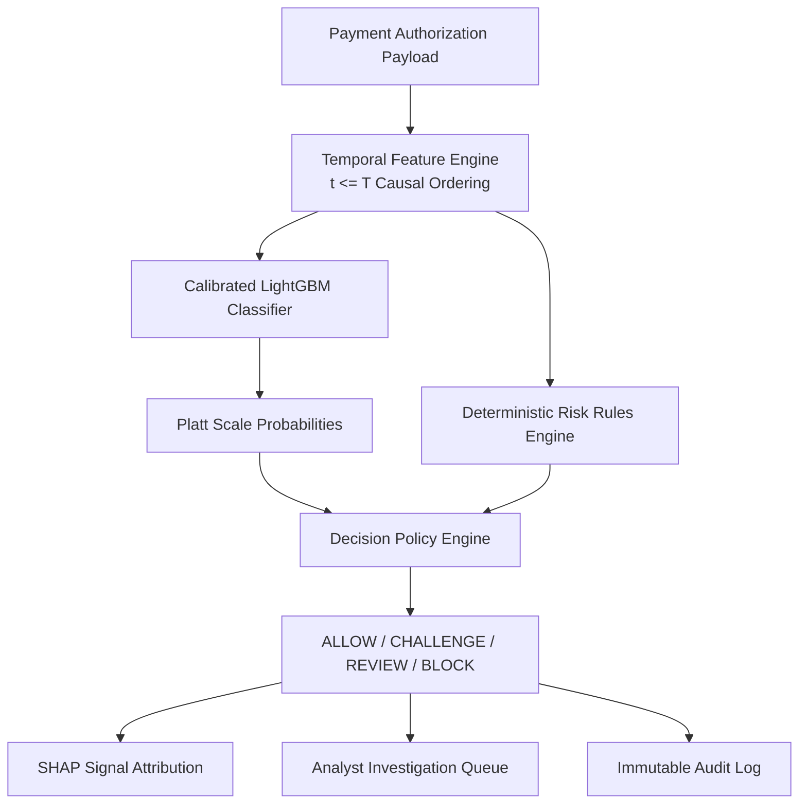

# SentinelRisk — Technical Architecture Document

## Overview

SentinelRisk is designed as a **Modular Monolith** optimizing for low operational complexity, high auditability, sub-20ms authorization latency, and clean separation of concerns.

---

## Component Architecture

### 1. Data Ingestion & Quality Validation (`backend/app/ingestion.py`)
- Reads raw transaction datasets (CSV / Parquet).
- Enforces strict validation checks: column schema, row counts, missing values, duplicates, SHA-256 hash.
- Generates structured JSON Data Quality Reports.

### 2. Feature Engineering (`backend/app/features.py`)
- **Strict Temporal Causal Ordering**: Sorts data strictly by `Time` to prevent future transaction leakage.
- Features: `log1p(Amount)`, amount z-scores, rolling velocity counters (1h, 6h, 24h), cyclic sin/cos time of day, rolling amount sums.

### 3. ML Model & Calibration (`backend/app/model.py`)
- Model: LightGBM Classifier with `scale_pos_weight` tuned for extreme 0.172% fraud class imbalance.
- Calibration: Sigmoidal Platt Scaling (`CalibratedClassifierCV`) yielding true calibrated probabilities $P \in [0.0, 1.0]$.
- Metrics evaluated: PR-AUC, ROC-AUC, Brier Score, Precision, Recall, F1.

### 4. Deterministic Risk Rules (`backend/app/rules.py`)
- Deterministic operational safety rules (`RULE_EXTREME_AMOUNT`, `RULE_HIGH_VELOCITY`, `RULE_NIGHT_HIGH_VALUE`, `RULE_ANOMALOUS_PATTERN`, `RULE_SCORE_BREACH`).
- Produces rule evidence, severity (`LOW`, `MEDIUM`, `HIGH`, `CRITICAL`), and human-readable explanation.

### 5. Decision Policy Engine (`backend/app/decisions.py`)
- Combines Risk Score (0-100) + Rule severities + Threshold policies.
- Outputs `ALLOW`, `CHALLENGE` (2FA), `REVIEW` (Analyst Queue), or `BLOCK`.

### 6. Explainability (`backend/app/explainability.py`)
- Computes feature attributions (SHAP signals) explaining why a model scored a transaction.
- Strictly avoids false causality statements ("caused fraud") in favor of contribution statements ("contributed to score").

### 7. Analyst Investigation Queue & Overrides (`backend/app/cases.py`)
- Automatically flags `REVIEW` and `BLOCK` transactions into `Case` records.
- Enables fraud analysts to investigate, add notes, and log decision overrides (`APPROVED` or `REJECTED`).
