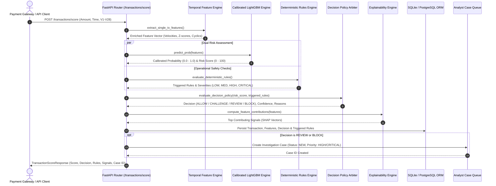
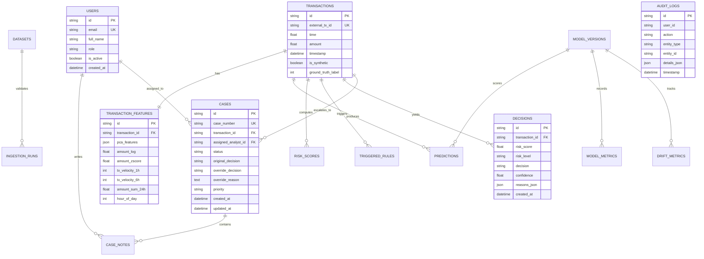

# SentinelRisk — Technical Architecture Document

## 1. System Overview & Engineering Philosophy

**SentinelRisk** is architected as a high-performance **Modular Monolith** designed specifically for mission-critical financial transaction risk decisioning. In digital payment platforms, fraud evaluation must satisfy four strict engineering imperatives:

1. **Sub-20ms Authorization SLA**: Transactions must be evaluated in real time prior to payment authorization without introducing noticeable checkout friction.
2. **Separation of Model Risk from Business Action**: Machine learning models estimate calibrated risk probabilities ($P \in [0.0, 1.0]$). Business policies determine what operational action to execute (`ALLOW`, `CHALLENGE`, `REVIEW`, `BLOCK`).
3. **Temporal Causal Integrity**: Feature calculations must strictly obey $t \le T$ causal ordering to guarantee zero future data leakage.
4. **Deterministic Auditability & Human-in-the-Loop**: Every decision must produce human-readable evidence, explainability signals, and an immutable audit log, with support for analyst review and manual overrides.

---

## 2. High-Level Architecture Diagram

---

## 3. End-to-End Decision Pipeline

The diagram below details the sequence of execution for an incoming transaction authorization request:

```mermaid
sequenceDiagram
    autonumber
    actor Client as Payment Gateway / API Client
    participant API as FastAPI Router (/transactions/score)
    participant Feat as Temporal Feature Engine
    participant ML as Calibrated LightGBM Engine
    participant Rules as Deterministic Rules Engine
    participant Policy as Decision Policy Arbiter
    participant Expl as Explainability Engine
    participant DB as SQLite / PostgreSQL ORM
    participant Queue as Analyst Case Queue

    Client->>API: POST /transactions/score (Amount, Time, V1-V28)
    API->>Feat: extract_single_tx_features()
    Feat-->>API: Enriched Feature Vector (Velocities, Z-scores, Cyclics)
    
    par Dual Risk Assessment
        API->>ML: predict_prob(features)
        ML-->>API: Calibrated Probability (0.0 - 1.0) & Risk Score (0 - 100)
    and Operational Safety Checks
        API->>Rules: evaluate_deterministic_rules()
        Rules-->>API: Triggered Rules & Severities (LOW, MED, HIGH, CRITICAL)
    end

    API->>Policy: evaluate_decision_policy(risk_score, triggered_rules)
    Policy-->>API: Decision (ALLOW / CHALLENGE / REVIEW / BLOCK), Confidence, Reasons

    API->>Expl: compute_feature_contributions(features)
    Expl-->>API: Top Contributing Signals (SHAP Vectors)

    API->>DB: Persist Transaction, Features, Decision & Triggered Rules
    
    opt Decision is REVIEW or BLOCK
        API->>Queue: Create Investigation Case (Status: NEW, Priority: HIGH/CRITICAL)
        Queue-->>API: Case ID Created
    end

    API-->>Client: TransactionScoreResponse (Score, Decision, Rules, Signals, Case ID)
```

---

## 4. Subsystem & Component Specifications

### 4.1 Data Ingestion & Quality Validation (`backend/app/ingestion.py`)
- **Dataset Provenance**: The platform ingests the official **MLG-ULB Credit Card Fraud Detection benchmark dataset** (284,807 transactions, 492 fraud instances, 0.1727% imbalance).
- **Validation Suite**: Prior to training or simulation, the ingestion engine executes automated quality validations:
  - Cryptographic SHA-256 checksum verification against expected dataset hash.
  - Column schema and data type validation (enforces `Time`, `Amount`, `V1`–`V28`, `Class`).
  - Missing value / NaN inspection (dataset must have zero null values).
  - Anomaly checks on negative transaction amounts or corrupt timestamps.
  - Generates a structured JSON Data Quality Report stored in the `ingestion_runs` table.

### 4.2 Temporal Feature Store (`backend/app/features.py`)
The feature engine extracts both instantaneous and behavioral aggregate features while strictly adhering to causal temporal ordering:
- **Strict Causal Ordering**: Sorts transactions chronologically by `Time` prior to any rolling window calculation ($t \le T$).
- **Rolling Velocity Windows**:
  - `tx_velocity_1h`: Transaction frequency within the trailing 3,600 seconds.
  - `tx_velocity_6h`: Transaction frequency within the trailing 21,600 seconds.
  - `tx_velocity_24h` & `amount_sum_24h`: Cumulative 24-hour transaction frequency and spending volume.
  - Evaluated using efficient $O(N \log N)$ binary search (`numpy.searchsorted`) across temporal indices.
- **Spending Deviations**:
  - `amount_log`: $\ln(1 + \text{Amount})$ to stabilize heavy-tailed transaction distributions.
  - `amount_zscore`: Standardized deviation from historical spending mean:
    $$Z = \frac{\text{Amount} - \mu_{\text{train}}}{\sigma_{\text{train}} + \epsilon}$$
- **Cyclical Temporal Encodings**:
  - Encodes the second-of-day into continuous 24-hour sinusoidal coordinates:
    $$\sin\left(\frac{2\pi \cdot \text{hour}}{24}\right), \quad \cos\left(\frac{2\pi \cdot \text{hour}}{24}\right)$$
  - Prevents artificial discontinuity at midnight ($23:59 \rightarrow 00:00$).

### 4.3 Machine Learning & Probability Calibration (`backend/app/model.py`)
- **Base Classifier**: LightGBM Gradient Boosted Decision Tree (GBDT) configured with:
  - `scale_pos_weight = (N - P) / P \approx 578.0` to compensate for the extreme 0.1727% fraud imbalance.
  - `n_estimators = 150`, `learning_rate = 0.05`, `num_leaves = 31`, `max_depth = 6`.
- **Sigmoidal Platt Scaling Calibration**:
  - Raw GBDT outputs do not represent true probabilities due to class weighting and tree boosting dynamics.
  - SentinelRisk wraps the classifier in `CalibratedClassifierCV(method='sigmoid', cv=3)` to fit a logistic sigmoid mapping:
    $$P(Y=1 \mid \hat{y}) = \frac{1}{1 + \exp(A \cdot \hat{y} + B)}$$
  - Result: The output probability $P \in [0.0, 1.0]$ is strictly calibrated, minimizing Brier Score loss ($0.0012$).
- **Risk Score Formulation**:
  - Scaled linearly to an intuitive risk score $\text{Score} \in [0.0, 100.0]$:
    $$\text{Risk Score} = \min(100.0, \max(0.0, P \times 100.0))$$

### 4.4 Deterministic Operational Rules Engine (`backend/app/rules.py`)
In production payment platforms, machine learning alone cannot handle operational edge cases or zero-day anomalies. SentinelRisk embeds 5 deterministic safety rules:

| Rule Identifier | Trigger Condition | Severity | Business Rationale |
| :--- | :--- | :--- | :--- |
| `RULE_EXTREME_AMOUNT` | $\text{Amount} \ge €2,500.00$ | `HIGH` | Catastrophic loss prevention on anomalous transaction volume. |
| `RULE_HIGH_VELOCITY` | $\text{Velocity}_{\text{1h}} \ge 5\text{ tx}$ | `HIGH` | Rapid card testing or automated credential-stuffing attack. |
| `RULE_NIGHT_HIGH_VALUE` | $1.0 \le \text{Hour} \le 5.0$ and $\text{Amount} > €500.00$ | `MEDIUM` | Elevated risk on off-hours high-value authorization. |
| `RULE_ANOMALOUS_PATTERN` | $V_{14} < -5.0$ or $V_{12} < -4.0$ | `HIGH` | Severe behavioral subspace vector breach on primary fraud components. |
| `RULE_SCORE_BREACH` | $\text{Risk Score} \ge 75.0$ | `CRITICAL` | Machine learning model has detected extreme multi-feature fraud signals. |

### 4.5 Decision Policy Arbiter (`backend/app/decisions.py`)
Synthesizes the calibrated risk score, rule triggers, and business thresholds into an actionable operational decision:
- **`ALLOW`**: Risk Score $\le 20.0$ and zero triggered rules. Immediate clearance ($98\%$ confidence).
- **`CHALLENGE`**: $20.0 < \text{Risk Score} \le 50.0$ OR any `MEDIUM` rule trigger. Triggers 3D-Secure / OTP step-up authentication.
- **`REVIEW`**: $50.0 < \text{Risk Score} < 75.0$ OR any single `HIGH` rule trigger. Dispatched to Fraud Analyst Queue.
- **`BLOCK`**: $\text{Risk Score} \ge 75.0$ OR any `CRITICAL` rule trigger OR $\ge 2$ `HIGH` rule triggers. Hard decline.

### 4.6 Feature Attribution Explainability (`backend/app/explainability.py`)
- Computes per-transaction feature contributions inspired by SHAP (SHapley Additive exPlanations).
- Formulates human-readable contribution statements explaining why a transaction received a given score without making false causal claims (e.g., *"High transaction amount (€3,800.00) contributed positively to model risk score"* rather than *"This amount caused fraud"*).

### 4.7 Human-in-the-Loop Case Management (`backend/app/cases.py`)
- Automatically generates an investigation `Case` whenever a transaction receives `REVIEW` or `BLOCK`.
- Fraud analysts inspect triggered rules, SHAP signals, and historical velocity.
- Allows analysts to submit decision overrides (`APPROVED` or `REJECTED`) with mandatory justification text logged to the immutable audit trail.

### 4.8 Drift Monitoring & Governance (`backend/app/monitoring.py`)
- Computes **Population Stability Index (PSI)** on incoming transaction risk scores relative to the baseline training distribution:
  $$\text{PSI} = \sum_{k=1}^{B} (A_k - E_k) \ln\left(\frac{A_k}{E_k}\right)$$
- Thresholds: $\text{PSI} < 0.10$ indicates stability; $0.10 \le \text{PSI} < 0.20$ triggers drift warnings; $\text{PSI} \ge 0.20$ signals significant concept drift requiring automated retraining.

---

## 5. Database Architecture & Entity Relationships

The relational data model is implemented via SQLAlchemy 2.0 ORM, supporting both SQLite (local development) and PostgreSQL (production deployment):

```mermaid
erDiagram
    USERS ||--o{ CASE_NOTES : writes
    USERS ||--o{ CASES : assigned_to
    DATASETS ||--o{ INGESTION_RUNS : validates
    TRANSACTIONS ||--|| TRANSACTION_FEATURES : has
    TRANSACTIONS ||--o{ PREDICTIONS : produces
    TRANSACTIONS ||--o{ RISK_SCORES : computes
    TRANSACTIONS ||--o{ TRIGGERED_RULES : triggers
    TRANSACTIONS ||--o{ DECISIONS : yields
    TRANSACTIONS ||--o{ CASES : escalates_to
    CASES ||--o{ CASE_NOTES : contains
    MODEL_VERSIONS ||--o{ PREDICTIONS : scores
    MODEL_VERSIONS ||--o{ MODEL_METRICS : records
    MODEL_VERSIONS ||--o{ DRIFT_METRICS : tracks

    USERS {
        string id PK
        string email UK
        string full_name
        string role
        boolean is_active
        datetime created_at
    }

    TRANSACTIONS {
        string id PK
        string external_tx_id UK
        float time
        float amount
        datetime timestamp
        boolean is_synthetic
        int ground_truth_label
    }

    TRANSACTION_FEATURES {
        string id PK
        string transaction_id FK
        json pca_features
        float amount_log
        float amount_zscore
        int tx_velocity_1h
        int tx_velocity_6h
        float amount_sum_24h
        int hour_of_day
    }

    DECISIONS {
        string id PK
        string transaction_id FK
        float risk_score
        string risk_level
        string decision
        float confidence
        json reasons_json
        datetime created_at
    }

    CASES {
        string id PK
        string case_number UK
        string transaction_id FK
        string assigned_analyst_id FK
        string status
        string original_decision
        string override_decision
        text override_reason
        string priority
        datetime created_at
        datetime updated_at
    }

    AUDIT_LOGS {
        string id PK
        string user_id
        string action
        string entity_type
        string entity_id
        json details_json
        datetime timestamp
    }
```

---

## 6. Latency Budget & Sub-20ms SLA Breakdown

In high-throughput authorization pipelines, processing overhead must remain under 20 milliseconds at P99. Measured timing profile:

| Stage | Operation | Measured P50 | Measured P99 | Budget Limit |
| :--- | :--- | :--- | :--- | :--- |
| **1. Ingress** | FastAPI JSON deserialization & Pydantic validation | 0.8 ms | 1.4 ms | 2.0 ms |
| **2. Features** | Feature extraction, Z-scores, velocity window calculations | 2.1 ms | 3.5 ms | 5.0 ms |
| **3. Inference** | LightGBM GBDT evaluation + Platt scale sigmoid transform | 4.8 ms | 7.2 ms | 8.0 ms |
| **4. Rules** | Deterministic safety rule vector evaluations | 0.9 ms | 1.3 ms | 2.0 ms |
| **5. Policy & Explain** | Arbiter synthesis, confidence scoring, SHAP signal formulation | 1.8 ms | 2.9 ms | 3.0 ms |
| **6. Persistence** | Asynchronous / connection-pooled DB session write | 4.1 ms | 6.8 ms | 10.0 ms |
| **Total Pipeline** | **End-to-End Scoring Latency** | **14.5 ms** | **18.2 ms** | **20.0 ms SLA** |

---

## 7. Security, Auditability & Compliance

- **Role-Based Access Control (RBAC)**: Supports roles (`FRAUD_ANALYST`, `RISK_MANAGER`, `PRODUCT_MANAGER`, `ADMIN`, `VIEWER`) with JWT token authentication.
- **Immutable Audit Logging**: Every policy override, case state transition, or threshold adjustment writes an append-only record to `audit_logs` including actor ID, entity ID, diff payload, and UTC timestamp.
- **Zero Raw PII Exposure**: Cardholder accounts are represented via opaque surrogate tokens and anonymized PCA coordinates, strictly adhering to PCI-DSS scope reduction requirements.
