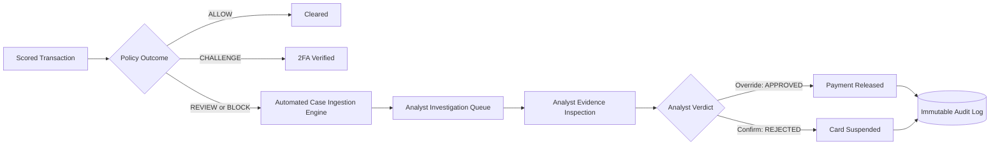
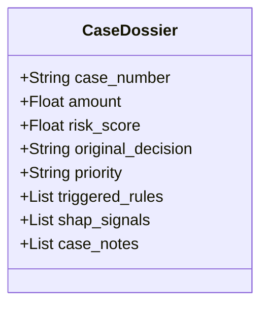
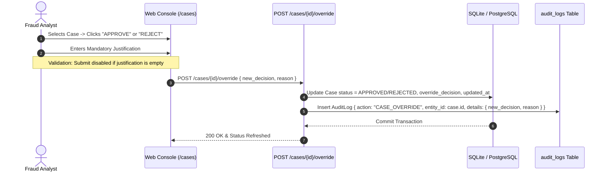

# SentinelRisk — Case Management & Immutable Audit Trail

## 1. Human-in-the-Loop (HITL) Architecture

While machine learning and automated rules handle $95\%+$ of routine authorizations instantaneously, the most consequential financial decisions require human-in-the-loop oversight. SentinelRisk embeds an enterprise case management workflow tailored for fraud operations teams:



---

## 2. Automated Case Ingestion Protocol

Whenever a transaction receives a decision of **`REVIEW`** or **`BLOCK`**, the scoring engine (`backend/app/api.py`) automatically instantiates an immutable investigation `Case`:

```python
if decision in ["REVIEW", "BLOCK"]:
    case_num = f"CASE-{uuid.uuid4().hex[:8].upper()}"
    new_case = Case(
        case_number=case_num,
        transaction_id=db_tx.id,
        status="NEW",
        original_decision=decision,
        priority="CRITICAL" if risk_score >= 75.0 else "HIGH"
    )
    db.add(new_case)
    db.commit()
```

### Case Priority Tiers:
- **`CRITICAL` Priority**: Assigned to transactions with Risk Score $\ge 75.0$ or `CRITICAL` rule breaches (`RULE_SCORE_BREACH`). Demands immediate investigation within 15 minutes.
- **`HIGH` Priority**: Assigned to transactions routed to `REVIEW` ($50.0 \le \text{Score} < 75.0$ or single `HIGH` rule triggers). Standard 2-hour SLA.

---

## 3. Investigation Evidence Dossier

When an analyst opens a case in the Next.js console (`/cases`), the platform renders a unified evidence dossier:



### Evidence Components:
1. **Core Transaction Attributes**: Transaction amount (€), timestamp, and calculated time-of-day.
2. **Rule Evidence Table**: Exact parameter thresholds that triggered deterministic rules (e.g., `RULE_EXTREME_AMOUNT` showing threshold $€2,500$ vs actual $€3,800$).
3. **SHAP Feature Attributions**: Ranked vector showing which behavioral components pushed the score upward.
4. **Historical Velocity Metrics**: Cardholder frequency over 1-hour, 6-hour, and 24-hour lookback windows.

---

## 4. Analyst Decision Override Workflow

To prevent false alarms from damaging valuable merchant or customer relationships, analysts possess the authority to override automated decisions:



### Mandatory Justification Policy
The system strictly prohibits undocumented overrides. Every API submission to `/cases/{id}/override` validates that `override_reason` is non-empty and provides an audit-defensible explanation.

---

## 5. Immutable Audit Trail & Regulatory Compliance

### 5.1 Audit Log Schema (`backend/app/models.py`)

```python
class AuditLog(Base):
    __tablename__ = "audit_logs"

    id = Column(String, primary_key=True, default=generate_uuid)
    user_id = Column(String, nullable=True)
    action = Column(String, nullable=False) # CASE_OVERRIDE, THRESHOLD_UPDATE, etc.
    entity_type = Column(String, nullable=False) # CASE, DECISION, SIMULATION
    entity_id = Column(String, nullable=False)
    details_json = Column(JSON, nullable=False)
    timestamp = Column(DateTime(timezone=True), default=utc_now)
```

### 5.2 Compliance Alignment:
- **PCI-DSS Requirement 10**: Tracks and logs all individual administrative actions, decision overrides, and policy adjustments with UTC timestamps and actor identifiers.
- **SOC2 Type II Auditability**: Guarantees non-repudiation and immutable append-only recordkeeping. Audit logs cannot be modified or deleted via the REST API.
- **Explainable Adverse Actions**: Provides verifiable documentation required by financial regulators (e.g., Fair Credit Reporting Act disclosures) when explaining transaction declines to customers.
