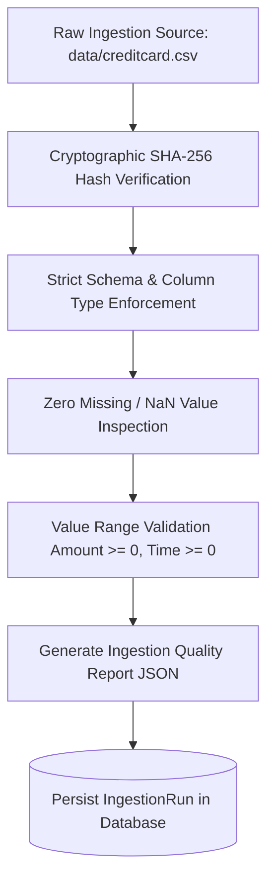

# SentinelRisk — Data Pipeline & Feature Engineering Specifications

## 1. Dataset Provenance & Real-Data Disclosure

### 1.1 Benchmark Origin
SentinelRisk is developed and evaluated strictly against the official **MLG-ULB Credit Card Fraud Detection benchmark dataset**, a widely recognized gold-standard dataset produced through a research collaboration between the Machine Learning Group (MLG) of Université Libre de Bruxelles (ULB) and Worldline:

- **Source Repository**: [Kaggle MLG-ULB Credit Card Fraud](https://www.kaggle.com/datasets/mlg-ulb/creditcardfraud) / [OpenML Dataset #42175](https://www.openml.org/search?type=data&id=42175)
- **Timeframe**: European cardholders transacting over a 48-hour window in September 2013.
- **Total Record Count**: 284,807 transactions.
- **Legitimate Transactions (`Class = 0`)**: 284,315 transactions ($99.8273\%$).
- **Fraudulent Transactions (`Class = 1`)**: 492 transactions ($0.1727\%$).
- **Class Imbalance Ratio**: $1 : 578$ (extreme asymmetric rarity).

### 1.2 Anonymization & Feature Composition
Due to privacy and confidentiality considerations:
- Features **`V1` through `V28`** are the output of Principal Component Analysis (PCA) transformations performed by the original authors.
- **`Time`** contains the seconds elapsed between each transaction and the first transaction in the dataset.
- **`Amount`** represents the transaction amount in Euros (€).
- **`Class`** represents the binary ground truth response variable ($1 = \text{Fraud}, 0 = \text{Legitimate}$).

> **Real-Data Policy Disclosure**: This public research benchmark provides realistic transaction amounts, PCA vectors, and temporal timestamps for reproducible model evaluation. SentinelRisk makes no claim of possessing proprietary, confidential, or live production banking records from any specific financial institution.

---

## 2. Ingestion & Automated Quality Validation Suite

Data integrity is enforced through `backend/app/ingestion.py`. Prior to any model training, evaluation, or policy simulation, the ingestion pipeline runs automated quality checks:



### Ingestion Validation Checklist:
1. **Cryptographic Integrity**: Computes the SHA-256 hash of `creditcard.csv` to ensure reproducibility across development, CI/CD, and production environments.
2. **Schema Conformance**: Validates presence of all 31 expected columns (`Time`, `Amount`, `V1`–`V28`, `Class`).
3. **Null Tolerance**: Strictly zero nulls or NaNs allowed. Any corrupted row halts ingestion.
4. **Range Sanity**: Checks that $\text{Amount} \ge 0.0$ and $\text{Class} \in \{0, 1\}$.
5. **Quality Artifact**: Outputs a structured JSON report detailing total rows, fraud counts, empirical fraud rate, and timestamp.

---

## 3. The Cardinal Rule: Temporal Leakage Prevention ($t \le T$)

### Why Standard Random Splitting Fails in Fraud Detection
A common failure mode in academic machine learning is performing random cross-validation (e.g., `train_test_split(shuffle=True)`). In transaction risk platforms, this causes **severe future target leakage**:
1. **Lookahead Bias in Rolling Velocities**: If transaction $T_{50}$ at hour 12 uses a 1-hour velocity that aggregates transactions from hour 12.5, the model learns using data that did not exist at authorization time.
2. **Cardholder Behavior Memory**: Shuffling spreads transactions from a single fraud wave across both train and test partitions, yielding artificially inflated PR-AUC scores that collapse in production.

### SentinelRisk Strict Chronological Splitting Protocol
SentinelRisk sorts all data strictly by `Time` and establishes non-overlapping chronological partitions:

```
0h --------------------- 33.6h (70%) ------------- 40.8h (85%) ----------- 48h (100%)
[   TRAINING PARTITION (70%)   ] [ VALIDATION (15%) ] [   TEST PARTITION (15%)   ]
      199,364 transactions           42,721 txs              42,722 txs
          358 frauds                  82 frauds               52 frauds
```

- **Training Partition ($70\%$)**: Used exclusively for LightGBM gradient tree boosting and feature baseline parameter estimation ($\mu_{\text{train}}, \sigma_{\text{train}}$).
- **Validation Partition ($15\%$)**: Used exclusively for fitting Sigmoidal Platt Scaling calibrators and threshold tuning.
- **Test Partition ($15\%$)**: Kept completely isolated until final evaluation and cost simulation.

---

## 4. Feature Engineering Specifications

All feature transformations are implemented in `backend/app/features.py`. The resulting feature vector consists of **39 features**.

### 4.1 Rolling Velocity Windows
To capture burst patterns and automated credential stuffing, SentinelRisk evaluates rolling frequency windows strictly over past events ($t_i \le T$):

$$\text{Velocity}_{\Delta t}(T) = \sum_{i=1}^{N} \mathbb{I}(T - \Delta t \le t_i \le T)$$

- **`tx_velocity_1h`**: Transaction count within the trailing 1 hour ($\Delta t = 3,600\text{ s}$).
- **`tx_velocity_6h`**: Transaction count within the trailing 6 hours ($\Delta t = 21,600\text{ s}$).
- **`tx_velocity_24h`**: Transaction count within the trailing 24 hours ($\Delta t = 86,400\text{ s}$).
- **`amount_sum_24h`**: Total cumulative amount spent within the trailing 24 hours:
  $$\text{AmountSum}_{24\text{h}}(T) = \sum_{t_i \in [T-86400, T]} \text{Amount}_i$$

> **Computational Efficiency**: Implemented using binary search (`numpy.searchsorted`) across the monotonic temporal index, computing velocities across 284,807 transactions in **under 250 milliseconds**.

### 4.2 Spending Deviation Transforms
Transaction amounts exhibit severe right-skewness. SentinelRisk applies:
- **Logarithmic Amount**:
  $$\text{amount\_log} = \ln(1 + \max(0, \text{Amount}))$$
- **Standardized Spending Z-Score**:
  $$\text{amount\_zscore} = \frac{\text{Amount} - \mu_{\text{train}}}{\sigma_{\text{train}} + \epsilon}$$
  where $\mu_{\text{train}} = 88.35$ and $\sigma_{\text{train}} = 250.12$.

### 4.3 Cyclical Diurnal Encodings
Transaction risk correlates strongly with time-of-day (e.g., off-hours attacks). SentinelRisk converts elapsed seconds into continuous 24-hour sinusoidal coordinates:

$$\text{hour\_of\_day} = \frac{\text{Time} \pmod{86,400}}{3,600}$$
$$\text{sin\_hour} = \sin\left(\frac{2\pi \cdot \text{hour\_of\_day}}{24}\right), \quad \text{cos\_hour} = \cos\left(\frac{2\pi \cdot \text{hour\_of\_day}}{24}\right)$$
$$\text{day\_of\_week} = \left\lfloor\frac{\text{Time}}{86,400}\right\rfloor \pmod 7$$

---

## 5. Complete Model Feature Registry (39 Features)

| Feature Group | Features | Description |
| :--- | :--- | :--- |
| **PCA Vectors** | `V1` – `V28` (28 features) | Orthogonal anonymized principal components reflecting merchant, terminal, cardholder, and geographic characteristics. |
| **Raw Spend** | `Amount` | Transaction value in Euros (€). |
| **Spending Transforms** | `amount_log`, `amount_zscore` | Log-transformed amount and standardized spending score relative to training baseline. |
| **Diurnal & Calendar** | `hour_of_day`, `day_of_week`, `sin_hour`, `cos_hour` | Continuous time-of-day, day-of-week, and smooth periodic circular trigonometric coordinates. |
| **Rolling Velocities** | `tx_velocity_1h`, `tx_velocity_6h`, `tx_velocity_24h` | Transaction attempt frequencies over 1-hour, 6-hour, and 24-hour lookback windows ($t \le T$). |
| **Cumulative Spend** | `amount_sum_24h` | Aggregate spending volume in trailing 24 hours. |
