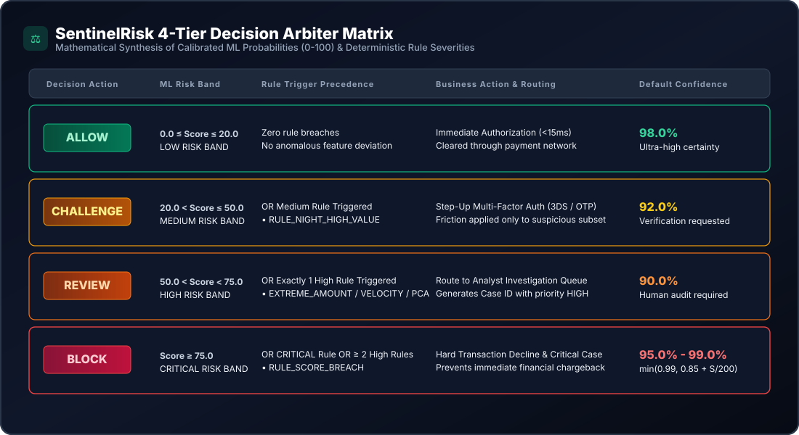
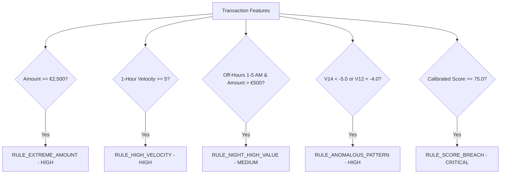
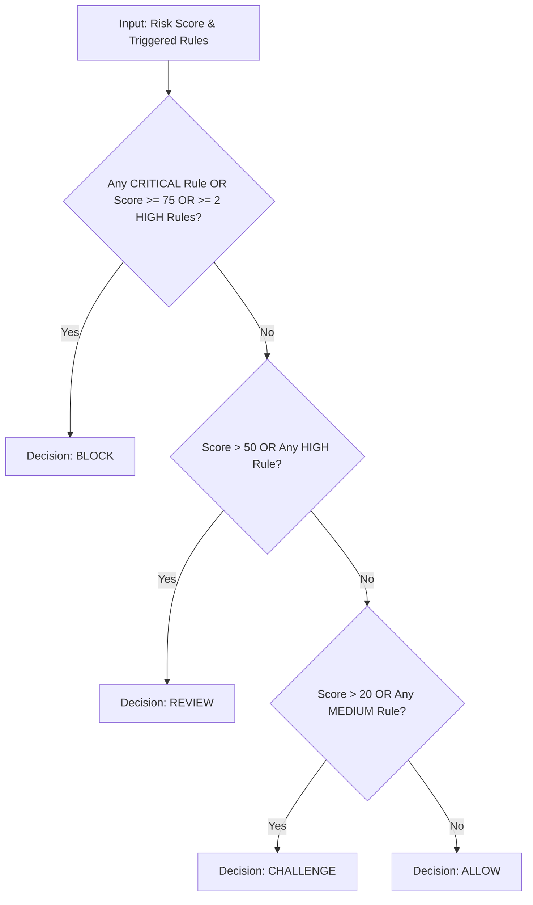

# SentinelRisk — Decision Intelligence & Deterministic Rules Engine

## 1. Decision Intelligence Philosophy

### 1.1 The Model vs. Action Decoupling Principle
In production financial technology, a common architectural error is equating model inference directly with a business action:

$$\text{Incorrect:} \quad \hat{y} = 1 \implies \text{BLOCK}, \quad \hat{y} = 0 \implies \text{ALLOW}$$

SentinelRisk adheres to the **Decoupled Decision Principle**:
1. **The Machine Learning Model Estimates Probability**: $P(\text{Fraud} \mid X) \in [0.0, 1.0]$.
2. **The Rules Engine Enforces Guardrails**: Captures operational limits, regulatory requirements, and extreme boundary anomalies.
3. **The Policy Arbiter Selects Action**: Considers risk appetite, dollar amounts, customer lifetime value, and operational capacity to choose one of four distinct actions:
   - **`ALLOW`** (Immediate clearance)
   - **`CHALLENGE`** (Multi-factor step-up verification)
   - **`REVIEW`** (Manual analyst queue triage)
   - **`BLOCK`** (Automated decline)

---

## 2. The 4-Tier Decision Matrix

### Comprehensive Action Tier Specifications:

| Decision Action | Calibrated Risk Band | Rule Trigger Precedence | Operational Action | Default Confidence |
| :--- | :--- | :--- | :--- | :--- |
| **`ALLOW`** | $\text{Score} \le 20.0$ | No rule breaches | Transaction cleared immediately ($<15\text{ ms}$). Zero customer friction. | **$98.0\%$** |
| **`CHALLENGE`** | $20.0 < \text{Score} \le 50.0$ | OR any `MEDIUM` rule | Cardholder prompted for 3D-Secure 2.0 / SMS OTP step-up authentication. | **$92.0\%$** |
| **`REVIEW`** | $50.0 < \text{Score} < 75.0$ | OR exactly 1 `HIGH` rule | Dispatched to Fraud Investigation Queue (`/cases`) with priority `HIGH`. | **$90.0\%$** |
| **`BLOCK`** | $\text{Score} \ge 75.0$ | OR any `CRITICAL` rule OR $\ge 2$ `HIGH` rules | Hard decline to payment gateway to prevent imminent chargeback loss. | **$95.0\% - 99.0\%$** |

---

## 3. Deterministic Safety Rules Engine (`backend/app/rules.py`)

Deterministic rules operate in parallel with machine learning to catch structural vulnerabilities and high-consequence edge cases:

### Detailed Rule Specifications:

#### 1. `RULE_EXTREME_AMOUNT`
- **Condition**: $\text{Amount} \ge €2,500.00$
- **Severity**: `HIGH`
- **Evidence Payload**: `{"amount": amount, "threshold": 2500.0}`
- **Rationale**: Single transaction amounts above €2,500 represent substantial financial exposure. Even if ML model score is moderate, human review is warranted.

#### 2. `RULE_HIGH_VELOCITY`
- **Condition**: `tx_velocity_1h` $\ge 5$ attempts
- **Severity**: `HIGH`
- **Evidence Payload**: `{"velocity_1h": velocity, "threshold": 5}`
- **Rationale**: High frequency bursts within 60 minutes typically indicate credential stuffing, automated card testing, or stolen credentials being liquidated.

#### 3. `RULE_NIGHT_HIGH_VALUE`
- **Condition**: $1.0 \le \text{hour\_of\_day} \le 5.0$ AND $\text{Amount} > €500.00$
- **Severity**: `MEDIUM`
- **Evidence Payload**: `{"hour_of_day": hour, "amount": amount}`
- **Rationale**: Significant spending during late-night off-hours deviates from normal retail cardholder patterns; warrants step-up challenge.

#### 4. `RULE_ANOMALOUS_PATTERN`
- **Condition**: $V_{14} < -5.0$ OR $V_{12} < -4.0$
- **Severity**: `HIGH`
- **Evidence Payload**: `{"V14": v14, "V12": v12}`
- **Rationale**: Components $V_{14}$ and $V_{12}$ correspond to the primary orthogonal axes separating fraudulent vectors in the PCA space. Extreme negative values reflect severe behavioral distortion.

#### 5. `RULE_SCORE_BREACH`
- **Condition**: $\text{Risk Score} \ge 75.0$
- **Severity**: `CRITICAL`
- **Evidence Payload**: `{"risk_score": score, "threshold": 75.0}`
- **Rationale**: When the calibrated machine learning probability breaches the critical threshold ($P \ge 0.75$), the rule engine enforces a mandatory hard decline override.

---

## 4. Conflict Resolution & Precedence Arbitration

When the statistical ML score and deterministic rules diverge, the policy arbiter (`backend/app/decisions.py`) resolves conflicts using hierarchical precedence:

### Conflict Resolution Scenarios:

1. **Scenario: Low ML Score with Extreme Amount**
   - *Inputs*: Calibrated Risk Score = $14.2$ (`LOW`), Amount = $€3,200.00$.
   - *Rule Triggered*: `RULE_EXTREME_AMOUNT` (`HIGH`).
   - *Outcome*: Arbitrated to **`REVIEW`**. The deterministic safety net prevents automatic clearance of high-exposure transactions.
2. **Scenario: Multiple High Rules with Moderate ML Score**
   - *Inputs*: Calibrated Risk Score = $48.5$ (`MEDIUM`), Velocity = $6\text{ tx/hr}$, Amount = $€2,900.00$.
   - *Rules Triggered*: `RULE_EXTREME_AMOUNT` (`HIGH`) + `RULE_HIGH_VELOCITY` (`HIGH`).
   - *Outcome*: Arbitrated to **`BLOCK`** ($\ge 2$ `HIGH` rules escalate directly to decline).
3. **Scenario: Pure Low Risk**
   - *Inputs*: Calibrated Risk Score = $4.8$ (`LOW`), Amount = $€45.00$, Velocity = $1$.
   - *Rules Triggered*: None.
   - *Outcome*: Arbitrated to **`ALLOW`** (Immediate authorization).

---

## 5. Decision Confidence Formulation

Confidence metrics represent policy certainty rather than raw probability:

$$\text{Confidence} = \begin{cases}
0.98 & \text{for } \text{ALLOW} \\
0.92 & \text{for } \text{CHALLENGE} \\
0.90 & \text{for } \text{REVIEW} \\
\min\left(0.99, 0.85 + \frac{\text{Risk Score}}{200.0}\right) & \text{for } \text{BLOCK}
\end{cases}$$

This ensures that hard blocks scale up in certainty ($95\% \rightarrow 99\%$) as the calibrated score approaches $100$.
