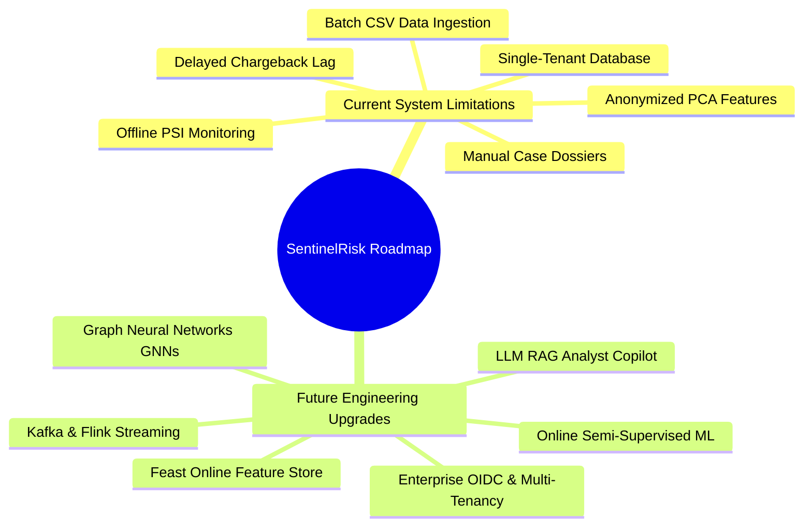
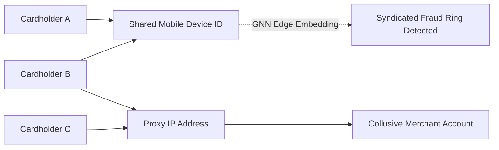

# SentinelRisk — Technical Limitations & Future Engineering Roadmap

## 1. Architectural Boundaries & System Boundaries

SentinelRisk is engineered as a production-grade transaction risk scoring and fraud decision intelligence platform. In order to provide transparent technical rigor, this document details the current architectural boundaries and constraints alongside the planned engineering upgrades designed to overcome them.



---

## 2. Technical Mapping: Current Boundaries vs. Target Engineering Solutions

| # | Current System Limitation | Technical Constraint | Planned Future Upgrade | Target Engineering Solution |
|---|:---|:---|:---|:---|
| **1** | **Anonymized Research Features** | Dataset features `V1`–`V28` are PCA vectors, omitting raw IP geolocation, device fingerprints, and merchant category codes (MCC). | **Heterogeneous Graph Neural Networks (GNNs)** | Build heterogeneous transaction graphs (`Cardholder` $\rightarrow$ `IP` $\rightarrow$ `Device` $\rightarrow$ `Merchant`) with **PyTorch Geometric / DGL** to uncover coordinated fraud rings and syndicated attacks. |
| **2** | **Batch Historical Data Pipeline** | Ingestion operates from static files rather than distributed real-time event logs. | **Streaming Event-Driven Architecture** | Deploy **Apache Kafka / Redpanda** + **Apache Flink** for streaming ingestion ($>10,000\text{ tx/sec}$) with stateful sub-second rolling velocity windows. |
| **3** | **Delayed Fraud Chargeback Labels** | Real-world fraud labels arrive with a 30–90 day chargeback lag from card networks, making supervised real-time updates impossible. | **Adaptive Online & Semi-Supervised Learning** | Implement incremental online learning algorithms (**River / Hoeffding Trees**) combined with semi-supervised pseudo-labeling for unconfirmed transactions. |
| **4** | **Offline Drift Monitoring** | Population Stability Index (PSI) is evaluated against fixed historical training partitions. | **Low-Latency Feature Store & Live Drift Alerts** | Integrate **Feast Online Feature Store** + **Evidently AI** to monitor streaming feature drift, concept drift, and data quality in sliding real-time windows. |
| **5** | **Manual Analyst Case Summaries** | Fraud analysts must manually interpret rule trigger evidence and raw SHAP feature vectors. | **LLM RAG Analyst Copilot** | Implement an **LLM Agent** with Retrieval-Augmented Generation (RAG) over transaction features, rule evidence, and cardholder history to automatically generate concise investigation dossiers. |
| **6** | **Monolithic Auth & Storage** | Embedded SQLite / single PostgreSQL instance without enterprise multi-tenant boundaries. | **Enterprise OIDC & Multi-Tenant Isolation** | Integrate **OAuth2 / OIDC (Keycloak / Okta)** with fine-grained Role-Based Access Control (RBAC), multi-tenant organization schemas, and SOC2-compliant audit controls. |

---

## 3. Deep-Dive: Target Architecture Upgrades

### 3.1 Heterogeneous Graph Neural Networks (GNNs) for Fraud Rings
In production payment networks, sophisticated fraud rarely occurs in isolation; it is executed by organized fraud rings sharing device fingerprints, synthetic IDs, burner phones, and IP proxies.
- **Planned Stack**: **PyTorch Geometric (PyG)**, **GraphSAGE**, **Relational Graph Convolutional Networks (R-GCN)**.
- **Topology**: Construct bipartite graphs connecting card accounts, device hashes, IP subnets, and merchant IDs. Graph embeddings will capture structural risk signals invisible to tabular tree classifiers.



### 3.2 High-Throughput Streaming Ingestion with Kafka & Flink
While the current $O(N \log N)$ binary search velocity calculations operate in sub-second time on local data, payment gateways transacting thousands of operations per second require streaming event processing.
- **Planned Stack**: **Redpanda / Apache Kafka** (distributed event log), **Apache Flink** (stateful stream processing), **Redis Enterprise** (low-latency velocity state store).
- **Streaming Pipeline**:
  ```
  Payment Gateway -> Kafka Topic -> Apache Flink (Tumbling & Sliding Windows) -> Redis State Cache (<1ms) -> FastAPI Scoring Engine
  ```

### 3.3 LLM-Powered Fraud Analyst Copilot (RAG)
When an analyst opens a complex investigation case, reviewing 39 feature vectors and 5 rule evidence payloads takes valuable minutes.
- **Planned Solution**: Embed an asynchronous **LLM Investigation Agent** using local or secure hosted models.
- **Sample Synthesized Case Dossier**:
  > *"Case CASE-9F2B81 flagged with Critical Risk (84.5/100). The transaction (€3,800.00) initiated at 03:15 AM represents a 15.2x deviation from this cardholder's 30-day average. In addition, 4 previous attempts occurred within the last 45 minutes on an unrecognized device fingerprint. Recommendation: Confirm identity via secondary phone authorization or decline."*

---

## 4. Research Data Integrity & Ethical Compliance

SentinelRisk utilizes the **MLG-ULB Credit Card Fraud Detection benchmark dataset** (284,807 transactions). This public dataset was produced through an anonymized European research collaboration.

SentinelRisk strictly adheres to transparent engineering disclosures:
1. **Public Research Benchmark**: Data is used exclusively for algorithm development, Platt scaling calibration, threshold simulation, and reproducible evaluation.
2. **Zero False Production Claims**: SentinelRisk makes no claim of processing live, unanonymized customer accounts from any specific bank.
3. **Privacy Compliance**: All feature vectors comply with privacy principles; no raw Personally Identifiable Information (PII) is stored or processed.
