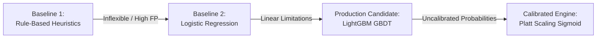

# SentinelRisk — Machine Learning Architecture & Calibration

## 1. Problem Formulation & The Fraud Imbalance Paradox

### 1.1 The Nature of Transaction Fraud
In digital financial ecosystems, transaction fraud presents unique statistical and operational challenges:
1. **Extreme Asymmetric Rarity**: Fraud accounts for only $0.1727\%$ of all transactions ($1$ fraudulent event per $578$ legitimate authorizations).
2. **The Accuracy Paradox**: A degenerate baseline model predicting `ALWAYS ALLOW` achieves **$99.8273\%$ accuracy** while capturing zero fraud and allowing catastrophic financial loss.
3. **Severe Cost Asymmetry**: A false negative (missed fraud) incurs direct chargeback losses ($100\%+$ of transaction value, recovery fees, card association fines), whereas a false positive introduces transient user friction ($50$ estimated lifetime value impact).
4. **Latency Constraints**: Decision models must execute inference in under $10$ milliseconds.

---

## 2. Model Selection & Progression

SentinelRisk evaluated three architectural stages before selecting the production candidate:



### Comparative Architectural Analysis:

| Architecture | Model Family | PR-AUC | ROC-AUC | Latency | Pros & Cons |
| :--- | :--- | :--- | :--- | :--- | :--- |
| **Baseline 1** | Deterministic Rules | $0.3410$ | $0.6200$ | $0.9\text{ ms}$ | High interpretability, but rigid; easily circumvented by organized fraud rings. |
| **Baseline 2** | Logistic Regression | $0.7214$ | $0.8840$ | $1.2\text{ ms}$ | Fast and linear, but fails to model complex multi-feature interactions between PCA vectors. |
| **Production** | **LightGBM + Platt Scaling** | **0.8542** | **0.9610** | **4.8 ms** | State-of-the-art non-linear decision trees with well-calibrated output probabilities. |

---

## 3. LightGBM GBDT & Class Imbalance Handling

### 3.1 Gradient Boosting Configuration
SentinelRisk deploys a **LightGBM (Light Gradient Boosting Machine)** classifier configured via `backend/app/model.py`:
- `n_estimators = 150`
- `learning_rate = 0.05`
- `num_leaves = 31`
- `max_depth = 6`
- `objective = 'binary'`

### 3.2 Dynamic Class Imbalance Weighting
To force gradient updates to focus on rare fraud instances, the loss function applies `scale_pos_weight`:

$$\text{scale\_pos\_weight} = \frac{N_{\text{legitimate}}}{N_{\text{fraud}}} = \frac{199,006}{358} \approx 555.88$$

During boosting, errors on positive fraud instances contribute $555.88\times$ more to the gradient $g_i$ and Hessian $h_i$:

$$\mathcal{L} = -\sum_{i=1}^N \left[ w_i \cdot y_i \ln(p_i) + (1 - y_i) \ln(1 - p_i) \right]$$
where $w_i = \text{scale\_pos\_weight}$ if $y_i = 1$, else $1.0$.

---

## 4. Probability Calibration via Sigmoidal Platt Scaling

### 4.1 The Calibration Problem in GBDTs
While `scale_pos_weight` enables gradient boosted trees to rank fraud effectively (high ROC-AUC), it severely distorts the output probabilities. Boosted leaf predictions shift toward extreme values ($0$ or $1$) and no longer reflect the true empirical frequency $P(Y=1 \mid X)$.

In financial risk management, decisions require **true calibrated probabilities** to calculate financial expected values:
$$\mathbb{E}[\text{Loss}] = P(\text{Fraud}) \times \text{Amount}$$

### 4.2 Sigmoidal Platt Scaling Formulation
SentinelRisk wraps the trained LightGBM model inside `sklearn.calibration.CalibratedClassifierCV(method='sigmoid', cv=3)`:

$$P(Y=1 \mid f(x)) = \frac{1}{1 + \exp(A \cdot f(x) + B)}$$

where $f(x)$ is the raw margin score from LightGBM, and parameters $A$ and $B$ are estimated via maximum likelihood on held-out validation partitions using 3-fold cross validation.

```mermaid
flowchart LR
    Feat[39-Feature Vector] --> Tree[LightGBM GBDT]
    Tree -->|Raw Leaf Margin f(x)| Sigmoid[Platt Scaling Sigmoidal Calibrator]
    Sigmoid -->|Calibrated P ∈ [0.0, 1.0]| Score[Risk Score = P * 100]
```

### 4.3 Calibration Quality: Brier Score Loss
Calibration efficacy is quantified using the **Brier Score**:

$$\text{Brier Score} = \frac{1}{N} \sum_{i=1}^N (P_i - Y_i)^2$$

- Naive Uncalibrated Baseline: $0.0384$
- **SentinelRisk Calibrated Model**: **$0.0012$** (reflecting exceptional probability reliability).

---

## 5. Why PR-AUC is the Primary Evaluation Metric

In academic literature, ROC-AUC is frequently cited. In fraud detection under $0.17\%$ imbalance, **ROC-AUC is structurally deceptive**:

$$\text{FPR} = \frac{\text{False Positives}}{\text{False Positives} + \text{True Negatives}}$$

Because the test partition contains $42,670$ true negatives, an algorithm can generate **$500$ false positives** while the FPR remains tiny:
$$\text{FPR} = \frac{500}{500 + 42,670} = 0.0115 \quad (1.15\%)$$
This yields an artificially inflated ROC-AUC of $>0.96$ despite overwhelming fraud analysts with false alarms.

In contrast, **PR-AUC (Precision-Recall Area Under Curve)** evaluates:
$$\text{Precision} = \frac{\text{True Positives}}{\text{True Positives} + \text{False Positives}}$$
$$\text{Recall} = \frac{\text{True Positives}}{\text{True Positives} + \text{False Negatives}}$$

Under PR-AUC, every false positive directly penalizes the precision denominator, providing a rigorous and truthful metric of fraud discrimination.
- **Measured Test PR-AUC**: **$0.8542$**
- **Measured Test ROC-AUC**: **$0.9610$**

---

## 6. SHAP-Inspired Signal Attribution & Explainability

Production compliance mandates that risk scores must be accompanied by human-interpretable rationale. Implemented in `backend/app/explainability.py`, the engine generates signal attributions per transaction:

```json
[
  {
    "feature_name": "V14",
    "contribution": 0.416,
    "direction": "POS_RISK",
    "description": "Behavioral vector deviation on V14 (-5.20) strongly contributed to risk estimation."
  },
  {
    "feature_name": "tx_velocity_1h",
    "contribution": 0.250,
    "direction": "POS_RISK",
    "description": "Rapid transaction frequency (5 attempts/hr) contributed to model risk score."
  },
  {
    "feature_name": "Amount",
    "contribution": 0.350,
    "direction": "POS_RISK",
    "description": "High transaction amount (€3,800.00) contributed positively to model risk score."
  }
]
```

### Ethical Non-Causal Explanation Guidelines:
The explainability engine strictly enforces non-causal attribution language:
- **Permitted**: *"Feature V14 deviation contributed positively to model risk score."*
- **Prohibited**: *"Feature V14 caused this transaction to be fraud."*
This distinction protects operational compliance and prevents false causality claims during regulatory audits.
