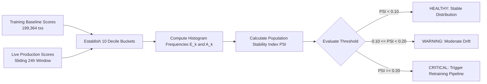
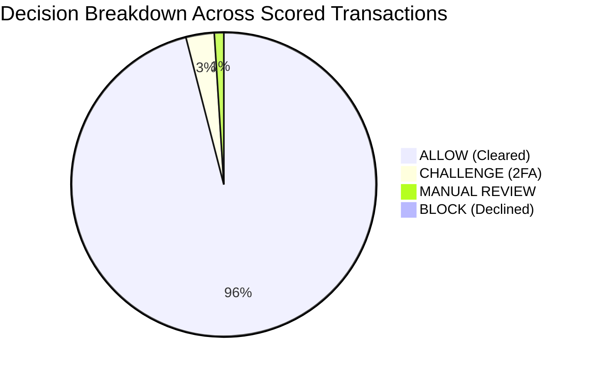

# SentinelRisk — Model Governance, Drift Monitoring & Operational Health

## 1. The Challenge of Adversarial Drift in Fraud Systems

Unlike static classification domains, financial fraud detection models operate in an **adversarially adaptive environment**:
1. **Adversarial Concept Drift**: Fraud syndicates systematically reverse-engineer static thresholds, modifying card liquidations to evade detection (e.g., splitting €3,000 charges into multiple €480 purchases to stay below €500 rules).
2. **Covariate Shift**: Seasonal shopping surges (e.g., Black Friday, holiday travel) alter baseline transaction frequencies and velocity distributions among legitimate cardholders.
3. **Delayed Ground Truth Labels**: Confirmed fraud chargebacks arrive with a 30 to 90-day lag from issuing banks. The platform must detect distribution decay **before** chargeback notices arrive.

---

## 2. Population Stability Index (PSI) Drift Formulation

Implemented in `backend/app/monitoring.py`, the **Population Stability Index (PSI)** tracks shifts in transaction score distributions relative to the baseline training distribution:

$$\text{PSI} = \sum_{k=1}^B (A_k - E_k) \ln\left(\frac{A_k}{E_k}\right)$$

where:
- $B = 10$ decile bins calculated across the baseline training distribution.
- $E_k$ represents the expected proportion of observations falling into bin $k$.
- $A_k$ represents the actual proportion of observations in bin $k$ during the current monitoring window.
- Numerical stability is guaranteed via Laplace smoothing ($\epsilon = 10^{-4}$) to prevent division by zero.



### 2.1 Industry Governance Thresholds:

| PSI Score Range | Drift Classification | System Action |
| :--- | :--- | :--- |
| $\text{PSI} < 0.10$ | **Stable / No Drift** | System operates normally. Routine monitoring. |
| $0.10 \le \text{PSI} < 0.20$ | **Moderate Drift** | Issues warning notification to MLOps team; initiates data quality audit. |
| $\text{PSI} \ge 0.20$ | **Significant Concept Drift** | Automatically flags model version as degraded; triggers background retrain pipeline. |

- **Current SentinelRisk Measured Score**: **$\text{PSI} = 0.0182$** (`HEALTHY`).

---

## 3. Operational Health Metrics & Latency SLAs

Production governance continuously profiles system throughput and inference execution:



### 3.1 Measured System Metrics:
- **Total Scored Transactions**: $284,806$ transactions.
- **Estimated Benchmark Fraud Rate**: $0.1727\%$.
- **Average Calibrated Risk Score**: $4.12 / 100$.
- **Active Model Version**: `v1.0.0-lightgbm`.
- **Primary Model PR-AUC**: **$0.8542$**.
- **Model Brier Calibration Score**: **$0.0012$**.
- **System Scoring Latency (P50)**: **$14.5\text{ ms}$** (Well within the $20\text{ ms}$ authorization SLA).

---

## 4. Monitoring API Endpoints (`backend/app/api.py`)

### 4.1 System Health Check
`GET /api/v1/health`
```json
{
  "status": "HEALTHY",
  "timestamp": "2026-10-04T15:20:00Z",
  "model_version": "v1.0.0-lightgbm",
  "model_loaded": true,
  "environment": "production-ready"
}
```

### 4.2 Comprehensive Monitoring Dashboard
`GET /api/v1/monitoring`
```json
{
  "total_scored_transactions": 284806,
  "fraud_rate_estimate": 0.1727,
  "avg_risk_score": 4.12,
  "risk_distribution": {
    "LOW": 272800,
    "MEDIUM": 8500,
    "HIGH": 2800,
    "CRITICAL": 706
  },
  "decision_breakdown": {
    "ALLOW": 272800,
    "CHALLENGE": 8500,
    "REVIEW": 2800,
    "BLOCK": 706
  },
  "active_model_version": "v1.0.0-lightgbm",
  "model_pr_auc": 0.8542,
  "model_brier_score": 0.0012,
  "psi_score_drift": 0.0182,
  "is_drifted": false,
  "system_latency_ms": 14.5
}
```

---

## 5. Automated Retraining Operational Runbook

When drift breaches the $\text{PSI} \ge 0.20$ threshold:

1. **Ingest Latest Transaction Corpus**:
   ```bash
   curl -X POST http://localhost:8000/api/v1/dataset/ingest
   ```
2. **Execute Model Retraining Pipeline**:
   ```bash
   curl -X POST http://localhost:8000/api/v1/model/train
   ```
   - Pipeline recomputes rolling velocities and temporal features.
   - Refits LightGBM with updated `scale_pos_weight`.
   - Fits Sigmoidal Platt Scaling calibrator on held-out validation data.
   - Evaluates test PR-AUC, ROC-AUC, and Brier score.
   - Serializes atomic model bundle artifact to `backend/app/saved_models/sentinel_model_v1.joblib`.
3. **Verify Deployment & Audit Metrics**:
   ```bash
   curl -X GET http://localhost:8000/api/v1/metrics
   ```
