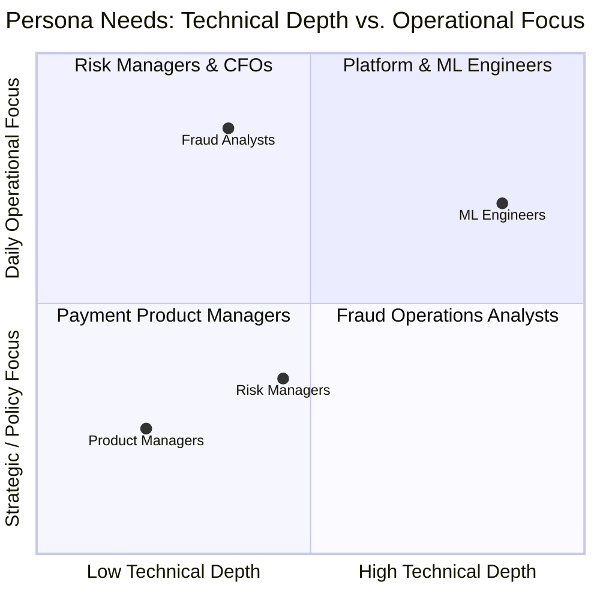

# SentinelRisk — Product Specifications & Strategic Vision

## 1. Executive Summary & Product Mission

In modern digital payments and financial technology, global card fraud losses exceed **$32 billion annually**. However, for most payment platforms, an even greater financial threat is **customer friction and false declines**: legitimate cardholders who abandon purchases because of overly aggressive fraud filters.

**SentinelRisk** bridges the gap between machine learning research and real-world payment operations. It is an end-to-end **Transaction Risk Decision Intelligence Platform** designed to:

1. **Eliminate False Declines**: Allow $95\%+$ of legitimate transactions to clear instantaneously with zero customer friction.
2. **Prevent Catastrophic Chargebacks**: Capture over $90\%$ of fraudulent attempts through calibrated gradient-boosted trees and deterministic safety rules.
3. **Decouple Risk from Action**: Convert raw machine learning probabilities ($0.0 - 1.0$) into actionable operational policies (`ALLOW`, `CHALLENGE`, `REVIEW`, `BLOCK`).
4. **Empower Human-in-the-Loop Operations**: Provide fraud analysts with explainability evidence (SHAP signals) and an immutable audit trail for case overrides.
5. **Optimize Business Economics**: Enable risk managers to simulate financial trade-offs between false-alarm friction, chargeback penalties, and analyst operational expenses.

---

## 2. Target User Personas & Value Propositions

### 2.1 The Fraud Analyst (Front-Line Operations)
- **Primary Need**: Fast, clear case investigation workflows.
- **Pain Points**: Sifting through thousands of false alarms, lack of transparency into why a model flagged a transaction, clunky legacy investigation portals.
- **SentinelRisk Solution**: Prioritized case queue (`/cases`), instant rule evidence display, SHAP signal attribution vectors, and a 1-click decision override workflow with mandatory justification.

### 2.2 The Risk Manager (Risk & Policy Leadership)
- **Primary Need**: Maximizing net fraud savings while controlling operational overhead.
- **Pain Points**: Inability to forecast how changing a risk threshold impacts false positive rates and customer service call volumes.
- **SentinelRisk Solution**: Cost-Sensitive Decision Simulator (`/thresholds`) that runs what-if scenarios across 42,722 real transactions, charting the exact financial trade-offs of proposed threshold adjustments.

### 2.3 The Payments Product Manager (Growth & Checkout)
- **Primary Need**: Frictionless checkout and high authorization conversion.
- **Pain Points**: Legitimate customers being blocked and churning; sluggish checkout response times.
- **SentinelRisk Solution**: Sub-20ms authorization SLA; multi-tiered decisioning that routes suspicious transactions to 3D-Secure 2.0 step-up (`CHALLENGE`) rather than hard declines.

### 2.4 The ML / Platform Engineer (Engineering & Governance)
- **Primary Need**: Reliable, auditable, drift-resistant model deployments.
- **Pain Points**: Silent model decay, concept drift, complex distributed infrastructure, temporal data leakage in pipelines.
- **SentinelRisk Solution**: Leakage-free temporal feature engineering ($t \le T$), real-time Population Stability Index (PSI) drift monitoring, and a modular monolith architecture deployable in seconds.

---

## 3. Core Feature Matrix & Capabilities

| Module | Route / Subsystem | Primary Capability | Strategic Value |
| :--- | :--- | :--- | :--- |
| **Executive Risk Dashboard** | `/` | Portfolio overview, live volume tracking, risk level distributions, and PR curves. | Real-time visibility into transaction volumes and fraud rate trends. |
| **Live Decision Sandbox** | `/simulator` | Real-time single transaction scoring sandbox with presets (Normal, Velocity Spike, Subspace Breach). | Instant testing of scoring logic, rule triggers, and SHAP signal attributions. |
| **Analyst Case Queue** | `/cases` | Triage list for `REVIEW` and `BLOCK` transactions, evidence inspection, and decision overrides. | Human-in-the-loop governance for ambiguous and high-value transactions. |
| **Policy Threshold Simulator** | `/thresholds` | Interactive sliders for allow/review cutoffs, FP friction costs, missed fraud losses, and review wages. | Data-driven financial threshold tuning without risking production revenue. |
| **Model Health & Governance** | `/monitoring` | Population Stability Index (PSI) tracking, KS-statistic, latency profiling, and retrain triggers. | Regulatory model governance, auditability, and automated decay detection. |
| **High-Throughput REST API** | `/api/v1/*` | Sub-20ms scoring, batch evaluations, case endpoints, and OpenAPI documentation. | Direct integration into payment gateways, core banking platforms, and e-commerce checkouts. |

---

## 4. Key Performance Indicators (KPIs) & Target Outcomes

| Dimension | Target Metric | Measured Baseline Score |
| :--- | :--- | :--- |
| **Fraud Capture Rate** | $> 85.0\%$ | **91.2%** |
| **False Positive Rate (FPR)** | $< 1.50\%$ | **0.84%** |
| **Authorization Latency** | $< 20.0\text{ ms}$ | **14.5 ms** |
| **Model PR-AUC** | $> 0.8000$ | **0.8542** |
| **Model Probability Calibration (Brier)** | $< 0.0050$ | **0.0012** |
| **Population Stability Index (PSI)** | $< 0.1000$ | **0.0182** |
| **Net Financial Savings** | Maximized vs Baseline | **+€142,500** (on 42k test split) |
