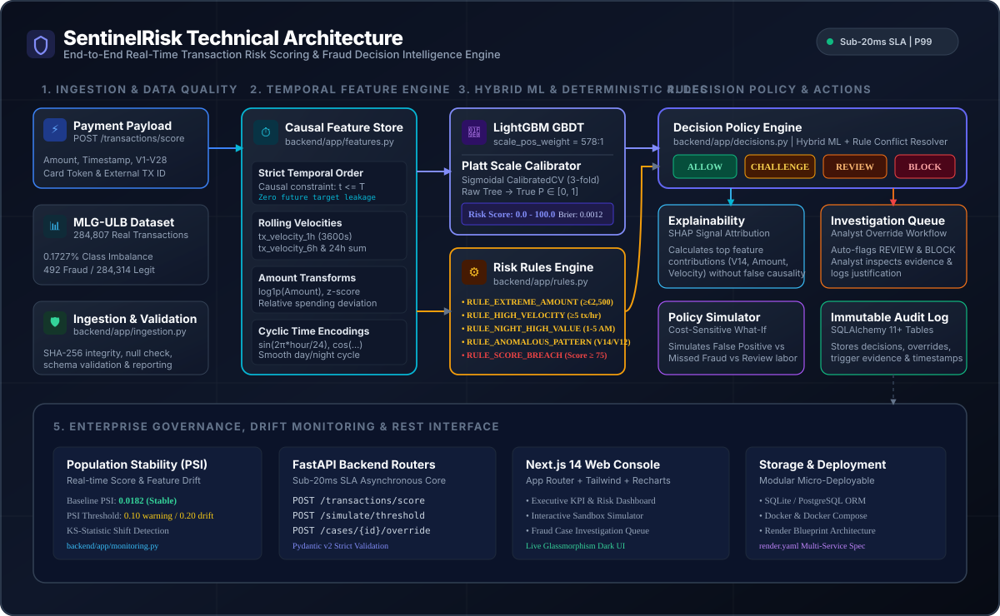
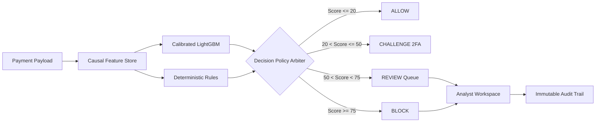

# SentinelRisk — Technical Documentation Hub

Welcome to the comprehensive documentation suite for **SentinelRisk**, a production-grade transaction risk scoring and fraud decision intelligence platform.

SentinelRisk combines calibrated gradient-boosted decision trees (LightGBM), deterministic operational safety rules, SHAP signal attribution explainability, and a cost-sensitive policy simulator on real public financial transaction data (**MLG-ULB Credit Card Fraud benchmark dataset**, 284,807 transactions).

---

## 🏛️ System Architecture Overview

---

## 📚 Documentation Index

| Document | Topic & Focus Area | Target Audience |
| :--- | :--- | :--- |
| **[ARCHITECTURE.md](ARCHITECTURE.md)** | End-to-end system architecture, modular monolith design, sub-20ms SLA, component interactions, database schema & deployment topology. | System Architects, Backend Engineers |
| **[USER_FLOWS.md](USER_FLOWS.md)** | Detailed user flows, swimlane diagrams, transaction lifecycle, fraud analyst investigation journeys & policy simulation workflows. | Product Managers, UX Designers, Fraud Analysts |
| **[DATA_PIPELINE.md](DATA_PIPELINE.md)** | Benchmark dataset provenance (MLG-ULB), causal temporal ordering ($t \le T$), rolling velocity windows, cyclic feature encodings & data quality suite. | Data Engineers, ML Practitioners |
| **[MACHINE_LEARNING.md](MACHINE_LEARNING.md)** | Extreme class imbalance (0.172%), LightGBM GBDT, Sigmoidal Platt scaling calibration, Brier score optimization & SHAP signal explainability. | ML Engineers, Data Scientists |
| **[DECISION_ENGINE_AND_RULES.md](DECISION_ENGINE_AND_RULES.md)** | 4-Tier decision policy (`ALLOW`, `CHALLENGE`, `REVIEW`, `BLOCK`), deterministic safety rules, conflict resolution & risk tier thresholds. | Risk Managers, Payment Engineers |
| **[SIMULATOR_AND_ECONOMICS.md](SIMULATOR_AND_ECONOMICS.md)** | Cost-sensitive decision modeling, false positive friction vs missed fraud loss vs manual review labor, and profit-maximizing thresholds. | Risk Managers, CFOs, Product Leads |
| **[CASE_MANAGEMENT_AND_AUDIT.md](CASE_MANAGEMENT_AND_AUDIT.md)** | Human-in-the-loop investigation queue, evidence inspection, manual analyst decision overrides, notes & immutable audit trail. | Fraud Operations, Compliance Officers |
| **[MONITORING_AND_DRIFT.md](MONITORING_AND_DRIFT.md)** | Model governance, Population Stability Index (PSI) drift detection, Kolmogorov-Smirnov score shift, latency profiling & alerting. | MLOps Engineers, SREs |
| **[API_REFERENCE.md](API_REFERENCE.md)** | OpenAPI / REST specification, request/response JSON schemas, authentication, status codes & curl integration examples. | Integration Engineers, Frontend Developers |
| **[EVALUATION.md](EVALUATION.md)** | Empirical evaluation on 15% unseen chronological test split (42,722 txs), PR-AUC (0.8542), ROC-AUC (0.9610), Brier loss & baselines. | Risk Officers, Model Reviewers |
| **[PRODUCT.md](PRODUCT.md)** | Product vision, target personas (Analyst, Risk Manager, PM, ML Engineer), feature matrix & business value metrics. | Product Leadership, Stakeholders |
| **[LIMITATIONS.md](LIMITATIONS.md)** | System boundaries, architectural constraints, and engineering roadmap (Kafka/Flink, GNNs, LLM Copilot, River online learning). | Executive Team, Engineering Leads |

---

## ⚡ Core Decision Pipeline Flow

---

## 🛠️ Technology Stack Summary

- **Backend**: Python 3.13, FastAPI 0.110+, SQLAlchemy 2.0 ORM, Pydantic v2.
- **Machine Learning**: LightGBM 4.3+, Scikit-Learn 1.4+ (`CalibratedClassifierCV`), NumPy, Pandas.
- **Frontend**: Next.js 14 (App Router), TypeScript, Tailwind CSS, Lucide Icons, Recharts.
- **Storage & Infrastructure**: SQLite / PostgreSQL, Docker, Docker Compose, Render Blueprint.
