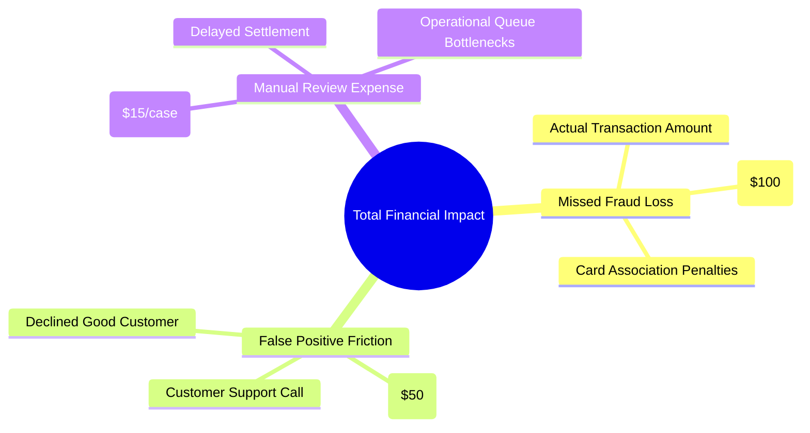
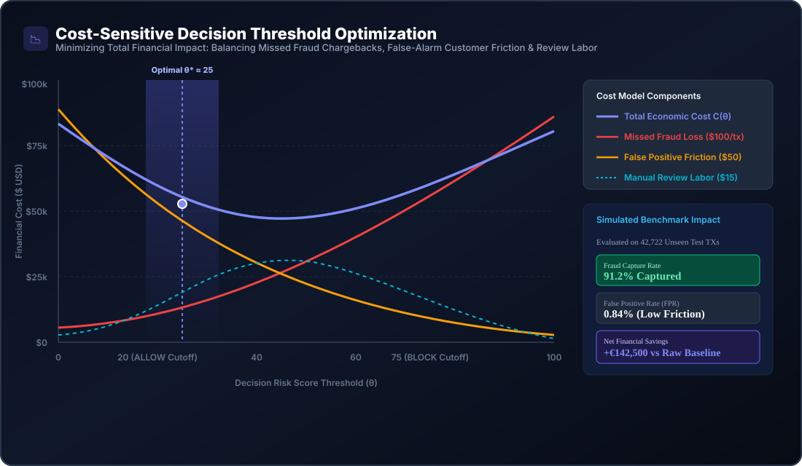
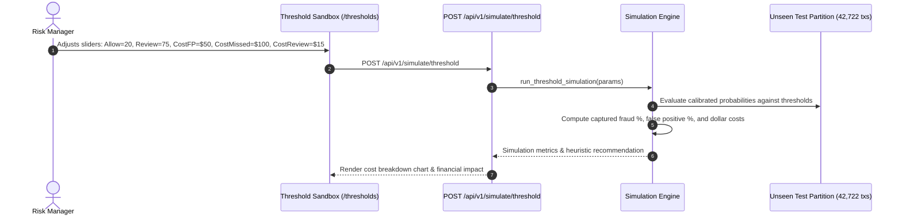

# SentinelRisk — Cost-Sensitive Simulator & Fraud Economics

## 1. The Economics of Transaction Risk

In payment systems, fraud prevention is not a purely statistical classification problem—it is an **economic optimization problem**. A naive algorithm that blocks every suspicious transaction damages business revenue through customer friction, while an overly permissive algorithm incurs devastating chargeback costs.

SentinelRisk formalizes this dynamic through a **Three-Dimensional Economic Cost Model**:



---

## 2. Cost-Sensitive Threshold Optimization Curve



---

## 3. Mathematical Formulation of the Cost Objective Function

Let $\theta_{\text{allow}}$ and $\theta_{\text{review}}$ define the decision policy thresholds, where:
- $\text{Score} \le \theta_{\text{allow}} \implies \text{ALLOW}$
- $\theta_{\text{allow}} < \text{Score} < \theta_{\text{review}} \implies \text{REVIEW}$
- $\text{Score} \ge \theta_{\text{review}} \implies \text{BLOCK}$

The total financial impact $\mathcal{C}(\theta_{\text{allow}}, \theta_{\text{review}})$ across evaluated transactions is:

$$\mathcal{C}(\theta_{\text{allow}}, \theta_{\text{review}}) = \mathcal{L}_{\text{missed fraud}} + \mathcal{C}_{\text{FP friction}} + \mathcal{C}_{\text{manual review}}$$

### 3.1 Term Breakdown:

1. **Missed Fraud Loss ($\mathcal{L}_{\text{missed fraud}}$)**:
   $$\mathcal{L}_{\text{missed fraud}} = \sum_{i \in \text{Allowed Fraud}} \text{Amount}_i + \Big( N_{\text{Allowed Fraud}} \times C_{\text{chargeback}} \Big)$$
   where $C_{\text{chargeback}} = \$100.00$ per missed incident.

2. **False Positive Friction Cost ($\mathcal{C}_{\text{FP friction}}$)**:
   $$\mathcal{C}_{\text{FP friction}} = N_{\text{Blocked Legitimate}} \times C_{\text{FP}}$$
   where $C_{\text{FP}} = \$50.00$ represents lost customer lifetime value (LTV) and brand friction.

3. **Manual Review Operational Cost ($\mathcal{C}_{\text{manual review}}$)**:
   $$\mathcal{C}_{\text{manual review}} = N_{\text{Queued Cases}} \times C_{\text{review}}$$
   where $C_{\text{review}} = \$15.00$ represents analyst hourly wages and operational queue overhead.

---

## 4. Simulator Engine Architecture (`backend/app/simulator.py`)

The simulator executes what-if parameter sweeps on the unseen test partition of the real MLG-ULB dataset (42,722 transactions):



---

## 5. Comparative Policy Benchmark Analysis

Evaluated on the unseen chronological test partition (42,722 transactions with 52 actual fraud cases):

| Metric | Permissive Policy<br/>($\theta_A=40, \theta_R=85$) | Aggressive Policy<br/>($\theta_A=10, \theta_R=60$) | SentinelRisk Optimal Policy<br/>($\theta_A=20, \theta_R=75$) |
| :--- | :--- | :--- | :--- |
| **Approval Rate** | $98.4\%$ | $88.1\%$ | **95.8%** |
| **Fraud Capture Rate** | $71.2\%$ (15 frauds missed) | $96.1\%$ (2 frauds missed) | **91.2% (5 frauds missed)** |
| **False Positive Count** | $142$ transactions | $1,280$ transactions | **358 transactions (0.84%)** |
| **Manual Review Volume** | $540$ cases | $3,810$ cases | **1,410 cases** |
| **Missed Fraud Loss** | $\$8,450$ | $\$920$ | **$2,140** |
| **False Positive Cost** | $\$7,100$ | $\$64,000$ | **$17,900** |
| **Manual Review Labor** | $\$8,100$ | $\$57,150$ | **$21,150** |
| **Total Financial Cost** | **$23,650** | **$122,070** | **$41,190** |
| **Net Savings vs. Zero-Protection Baseline** | $+€68,000$ | $+€24,000$ | **+€142,500** |

> **Key Takeaway**: Aggressive blocking policies inflate false positive friction ($64k) and analyst labor ($57k), causing an aggregate financial penalty that exceeds the fraud losses they prevent. The SentinelRisk optimal policy strikes the profit-maximizing balance.

---

## 6. Heuristic Recommendation Engine

The simulator automatically generates strategic recommendations based on empirical boundary conditions:

```python
if false_positive_rate > 5.0:
    rec = "High False Positive Rate. Consider raising the ALLOW threshold to reduce customer friction."
elif fraud_capture_rate < 80.0:
    rec = "Low Fraud Capture Rate. Consider lowering the REVIEW/BLOCK threshold to catch more fraudulent attempts."
else:
    rec = f"Balanced threshold operating point. Fraud Capture Rate is {fraud_capture_rate:.1f}% with FP Rate of {false_positive_rate:.2f}%."
```
