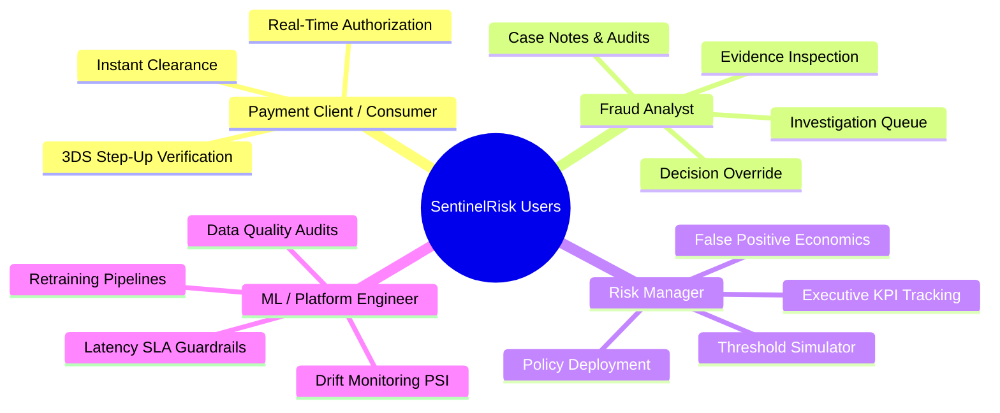
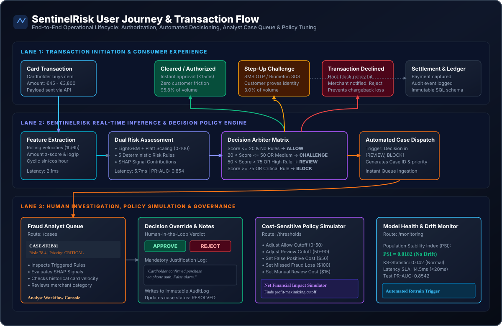
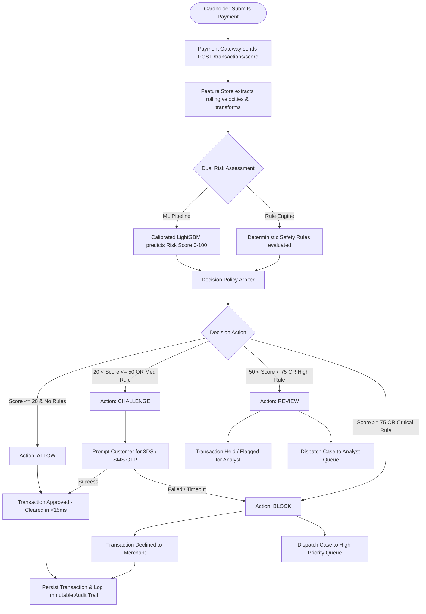
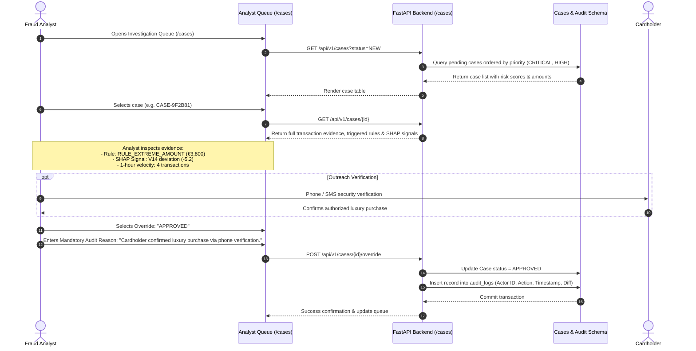
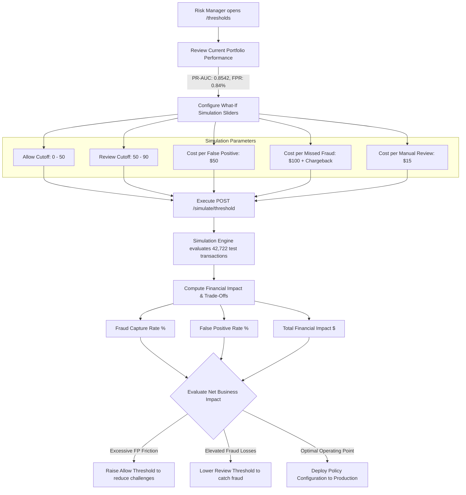
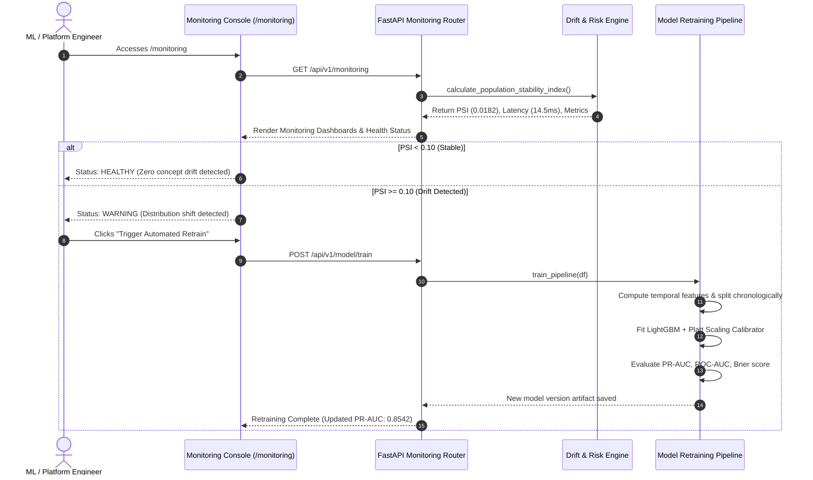
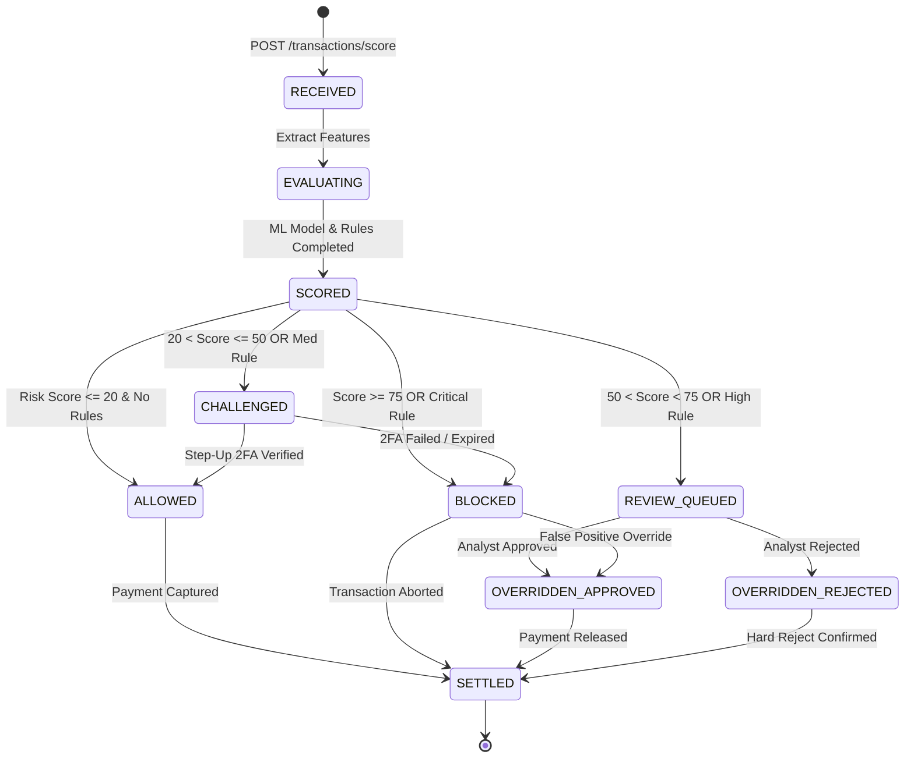
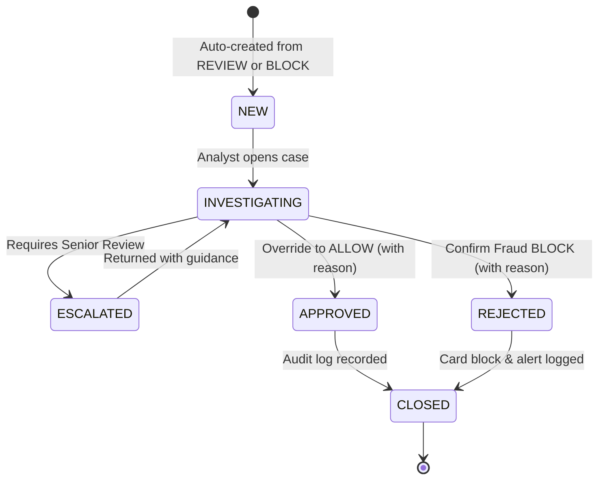

# SentinelRisk — User Flows & Operational Journeys

## 1. Overview & Stakeholder Personas

SentinelRisk coordinates multiple operational personas across the lifecycle of a financial transaction. Rather than serving as an isolated algorithmic classifier, the system orchestrates real-time automated decisions with human-in-the-loop oversight and business policy simulation.

---

## 2. Global Operational Flow Diagram

---

## 3. Journey 1: Real-Time Payment Authorization Lifecycle

The primary transactional flow executes within a strict sub-20ms latency window when a cardholder attempts an online purchase.

### Detailed Operational Steps:
1. **Ingress**: Payment gateway submits authorization payload containing `amount`, `time`, and contextual features to `POST /api/v1/transactions/score`.
2. **Feature Extraction**: Instantaneous features ($Z$-scores, log amount, cyclical hour of day) and rolling velocity metrics are computed ($t \le T$).
3. **Dual Assessment**:
   - **Machine Learning**: Generates a calibrated risk score between `0.0` and `100.0`.
   - **Rule Engine**: Concurrently executes 5 deterministic safety rules to flag immediate operational violations.
4. **Policy Arbitration**: Synthesizes the score and rule severities into one of four action outcomes:
   - **`ALLOW`**: Low risk; approved without customer friction.
   - **`CHALLENGE`**: Moderate risk; prompts cardholder for step-up verification.
   - **`REVIEW`**: Elevated risk; routed to fraud analysts for inspection.
   - **`BLOCK`**: High risk; declined immediately to prevent chargebacks.
5. **Audit Persistence**: Every decision, rule evidence payload, and SHAP signal vector is written to the database.

---

## 4. Journey 2: Fraud Analyst Investigation & Decision Override

Fraud analysts investigate transactions routed to the manual review queue or critical blocked cases.

### Analyst Workflow States:
- **Case Ingestion**: Automatic creation when decision is `REVIEW` or `BLOCK`.
- **Evidence Review**: Analyst inspects:
  1. Calibrated Risk Score (e.g., `78.4 / 100`).
  2. Triggered Rule Evidence (exact values vs thresholds).
  3. Top SHAP signal attributions explaining feature weights.
  4. Temporal velocity history.
- **Decision Override**: The analyst may override the automated verdict:
  - `APPROVED`: False positive released.
  - `REJECTED`: Confirmed fraudulent attempt; card frozen.
- **Mandatory Audit Logging**: Overrides require justification text; written to append-only audit tables for regulatory compliance.

---

## 5. Journey 3: Risk Manager Policy Tuning & Threshold Simulation

Risk managers configure decision boundaries to balance fraud losses against customer friction and operational review costs.

### Optimization Dynamics:
- **Cost Minimization**: The platform solves for the optimal threshold tuple $(\theta_{\text{allow}}^*, \theta_{\text{review}}^*)$ that minimizes:
  $$\text{Total Cost} = \text{Loss}_{\text{missed fraud}} + \text{Cost}_{\text{FP friction}} + \text{Cost}_{\text{manual review}}$$
- **Live Sandbox**: The Next.js frontend recalculates outcomes in real time across the unseen test split.

---

## 6. Journey 4: Platform & MLOps Engineer Governance & Retraining

ML engineers monitor model health, feature drift, and trigger continuous retraining.

---

## 7. State Machine Specifications

### 7.1 Transaction State Machine

### 7.2 Investigation Case State Machine

